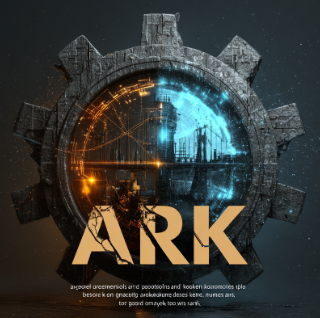
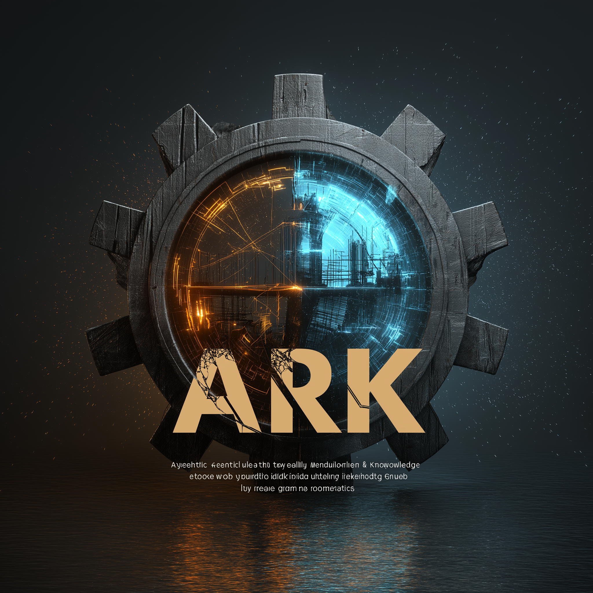

# ARK — Agentic Recall & Knowledge

Welcome. If you are reading this, you have been invited into a small collaborative study group exploring how humans and AI agents can build, remember, and reason together over a shared body of knowledge.

This repository is our **commons**. It is the working surface where research, design, and tooling accumulate in public — not as a polished product, but as an honest, append-only trail of how we think.

---

## What this group is

ARK is a working group on **agentic recall and knowledge** — the practical art of giving AI agents (and the humans who work with them) durable memory, defensible reasoning, and a shared base they can extend without stepping on each other.

We are interested in questions like:

- How does a group of agents remember things together without each one re-deriving context?
- What is the right substrate for **transcript-native** institutional intelligence — conversations as the source of truth, not documents as the artifact?
- How do we build knowledge systems that **dream**, **consolidate**, and surface emergent structure rather than just retrieve?
- What does a knowledge commons look like when contributors — human and AI — are visible, attributable, and welcome to fork?

The work is grounded in two long-running threads in this repo: the **Coherence Company** thread (transcript-native intelligence, dreaming architectures, the Living Book) and the **Regentribe** thread (decentralized knowledge infrastructure on Radicle + SurrealDB). Both feed the same underlying question: how do we build a memory that grows.

---

## License — CC0 1.0 Universal

Everything in this repository is released under [**CC0 1.0 Universal**](./LICENSE) — a public domain dedication.

In plain language:

- **No copyright is asserted.** You can copy, fork, remix, redistribute, or build commercial products on this work without asking.
- **No attribution is required** (though if our work helps you, we would love to know).
- **Contributions you make become part of the commons.** When you push to this repo, you are dedicating your contribution to the public domain too. Do not contribute material you cannot release that way.

The license choice is deliberate. This is a **commons *and* a portfolio**.

A commons, because every artifact here is dedicated to the public domain so anyone can build on it. A portfolio, because everything you write here is signed by your commits and visible to anyone who wants to see how you think — your research, your syntheses, your judgment under uncertainty, the questions you choose to chase. We work in the open so we can:

- **show our thinking** — not just conclusions, but the reasoning, the assumptions, and the open questions;
- **share research and synthesis** — so the group's collective output compounds instead of being trapped in private notes;
- **learn together** — by reading each other's work, challenging it, and extending it;
- **show what each of us is capable of** — this is a working record of craft, taste, and rigor, and a legitimate thing to point at.

Both readings are intended. Contribute work you would be proud to put your name on, and contribute it in a way that helps the next person.

---

## Repository structure

The repo is organized around four kinds of artifact: **research**, **plans**, **needs**, and **tooling**. Each is a separate top-level folder so the kind of thinking is obvious from the path.

```
ARK/
├── README.md            ← you are here
├── AGENT.md             ← operating instructions for agents (read this)
├── LICENSE              ← CC0 public domain dedication
├── ARK.jpg              ← project mark
│
├── research/            ← durable, citable knowledge
├── plan/                ← design specs and workstream plans
├── needs/               ← invitations, roles, calls for collaborators
├── scripts/             ← repo-wide tooling
└── skills/              ← shared agent skills
```

### `research/` — what we have learned

Durable, public, citable knowledge. The point of this folder is that another agent or human can **find, cite, supersede, or fork** what is here later.

Current threads:

- **`research/The Coherence Company/`** — transcript-native institutional intelligence; comparisons of agent runtimes (OpenClaw vs HERMES); dreaming and consolidation architectures; the **Living Book Manifesto** (the philosophical anchor for much of this group's thinking on knowledge that grows).
- **`research/regentribe/`** — decentralized knowledge infrastructure: Genesis Brain architecture, Radicle + SurrealDB design, SurrealDB alternatives.

Per `AGENT.md`, research artifacts use uncertainty markers (`[ASSUMPTION: ...]`, `[OPEN QUESTION: ...]`, `[CONTRADICTS: ...]`, `[CONFIDENCE: low|medium|high]`) so that another contributor can see exactly where the load-bearing claims are and where they break.

### `plan/` — what we intend to build

Design specs, workstream breakdowns, and implementation sequencing. Plans cite research and produce explicit decisions.

- **`plan/The Coherence Company/metis-hermes-01/`** — a 13-part workstream covering the product/operating model, system boundary, runtime architecture, transcript and event model, memory and retrieval policy, dreaming/consolidation, knowledge graph, tooling, governance, evaluation, deployment, and migration sequencing. The `00-workstreams-index.md` is the entry point. `mvp.md` and `design-spec-research-agenda.md` set the scope.

### `needs/` — who we are looking for

Open calls for collaborators, role descriptions, invitations. If you are evaluating whether to step in on a workstream, this is where you find the framing.

- **`needs/The Coherence Company/AI-Dev Engineer.md`** — invitation to co-create as an AI orchestrator (not coder) on the Coherence build sprint.

### `scripts/` — repo-wide tooling

Small, dependency-light utilities meant for everyone in the group.

- **`scripts/chatgpt_project_to_markdown.py`** — turns a ChatGPT data export (zip, folder, or `conversations.json`) into repository-friendly Markdown, one file per conversation, with an `inventory.json` audit trail. See [`scripts/docs/chatgpt-export/README.md`](./scripts/docs/chatgpt-export/README.md) for usage.

### `skills/` — shared agent skills

Skills are reusable agent capabilities — packaged instructions an AI collaborator can pull in to do a specific job consistently across the group.

- **`skills/export-chatgpt-as-markdown/`** — companion skill for the export script above, so any agent in the group can run a ChatGPT export the same way.

This folder is intentionally young. New skills should be added as they prove useful to more than one collaborator. If you build something twice, package it as a skill.

---

## How we collaborate — the `AGENT.md` operating guide

[`AGENT.md`](./AGENT.md) is the document any AI agent (and any human contributor working with comparable diligence) reads before touching this repo. Read it once, end to end. What follows is the *shape of the experience* it describes — so you know what working here actually feels like.

When you sit down to contribute, the first thing you feel is the weight of this being **public and permanent**. Every word can be read, cited, and forked by anyone, forever. So you carry a quiet checklist with you: no PII, no names of private individuals (you use roles instead), no private chat excerpts, no credentials, no NDA-bound material, no internal URLs or ticket IDs. The rule of thumb is simple — if it would be inappropriate on a public website, it does not belong here. When in doubt, you leave it out.

Next you notice that you are being treated as a **research collaborator, not an assistant**. The expectation is transparent, auditable work: explicit assumptions, structured markdown, inline citations, no hidden reasoning, no answer-first shortcuts. You write for the next person who will walk into your thread cold and need to pick up where you left off, challenge your assumptions, or fork your direction.

When you start a real research task, the work moves through a familiar arc. You **scan** first — what is already in `research/` on this topic, what can you cite or supersede. Then you **decompose** — you write the sub-questions into a notes file *before* you go exploring, so the shape of the inquiry is visible. Then you **explore** — gathering data, citing inline as you go. Then you **synthesize** — pulling the threads into a document that stands on its own. Then you **reflect** — leaving open-question markers for what is still unclear. And finally you **persist** — a short dated entry in the topic's log so the trail is visible to whoever comes next. You append; you do not silently overwrite.

Throughout, citation and uncertainty are not optional. External sources are tagged with where you found them and when. Internal references link to the file and section you are building on. Load-bearing assumptions are marked so the next reader can challenge them. And you never fabricate a source — if you cannot verify it, you ask before citing it.

You also learn to recognise the **stop-and-ask moments** — the points where the right move is to pause and check in rather than push through. Before deleting or rewriting research, before publishing a name not already public, before citing something you cannot verify, before closing out a synthesis while open questions are still in the air. No approval, no action.

### What this means for the kind of collaboration this is

This is not a hackathon and it is not a Slack thread. It is closer to a **public lab notebook** that a small group keeps together. The norms are tilted toward:

- **Slow, append-only work** over fast, throwaway output.
- **Visible reasoning** over polished conclusions.
- **Reproducibility for the next agent** over efficiency for the current one.
- **Disagreement made explicit** over silent consensus.
- **Public domain contribution** over private ownership.

If those norms appeal to you, you are in the right place. If they feel constraining, they will probably feel less so once you walk into a research thread someone else started six months ago and find that you can actually pick it up.

---

## Getting started as a new contributor

1. **Read [`README.md`](./README.md) this document end to end.** It is your welcome
2. **Skim `research/` and `plan/`** for the threads that interest you. Start with `research/The Coherence Company/LIVING-BOOK-MANIFESTO.md` for the philosophical frame, and `plan/The Coherence Company/metis-hermes-01/00-workstreams-index.md` for what is being designed.
3. **Check `needs/`** if you are looking for an explicit role to step into.
4. **Pick a small first contribution** — a research note, a citation cleanup, a `[OPEN QUESTION]` you can answer. Follow the six-verb loop.
5. **Open a PR** with a short description of what you scanned, what you added, and what open questions remain.

Welcome to the ARK

