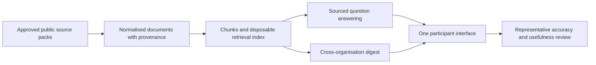

# ARC Agent remote hackathon — technical plan

**Status:** Two-hour bootstrap specification plus build-on-top baseline  
**Event format:** Remote-only, two build days  
**Technical owner:** `[TO SET: PUBLIC ROLE OR APPROVED PUBLIC IDENTITY]`  
**Repository:** `[TO SET]`  
**Staging URL:** `[TO SET PRIVATELY IF ACCESS-CONTROLLED]`  
**Budget owner:** `[TO SET: PUBLIC ROLE]`  
**Budget ceiling:** EUR 50 equivalent for preparation and the event

## 0. Two-hour pre-ramp bootstrap

The basic agent is organiser infrastructure, not a hackathon deliverable. It must be working before invitations are sent and before the two-week participant ramp begins.

### Runtime decision

Choose one primary runtime:

- **Hermes** is the default when the immediate goal is one long-lived agent that accumulates working context and helps with preparation.
- **OpenClaw** is the default when immediate Telegram or multi-channel gateway routing is more important than the agent’s learning workflow.
- **Both** may be installed only when two operators can work in parallel. The primary runtime must still pass its smoke test within two hours; the comparison is discarded if it delays the working agent.

This follows the repository’s existing conclusion: Hermes fits the first “brain,” while OpenClaw becomes more attractive as a multi-channel gateway. Neither runtime should become the canonical knowledge store. [see: research/The Coherence Company/CoCo-OpenClaw-vs-Hermes.md#recommended-architecture-for-coco]

### Preconditions before the two-hour clock starts

- One technical operator is named and has control of the target machine.
- The target machine or existing server is running and reachable.
- The public repository is already cloned.
- One model-provider credential is available through a private secret-delivery method.
- The operator has selected the primary runtime based on current familiarity and the immediate interface requirement.
- One approved public sample source is selected.

Account procurement, server purchasing, DNS changes, organisational permission discussions, and hunting for credentials are not part of the two-hour installation block. If these are unresolved, resolve them before scheduling the block.

### Two-hour timebox

| Time | Action | Required evidence |
|---|---|---|
| 0:00–0:10 | Confirm primary runtime, target machine, provider access, workspace path, and interface | Written bootstrap choices; no architecture debate |
| 0:10–0:35 | Install the selected OpenClaw or Hermes runtime and start its simplest local interface | Runtime responds to a basic prompt |
| 0:35–0:55 | Configure the model provider, isolated agent workspace/profile, and secret injection | Agent runs without any credential in Git or public documentation |
| 0:55–1:20 | Give the agent read access to the public proposal, execution documents, and one approved sample source | Agent can locate and summarise the allowed material |
| 1:20–1:45 | Configure its working instructions: source references, public-data boundary, draft-only event assistance, and human approvals | Behaviour rules are present in an inspectable workspace file |
| 1:45–2:00 | Run smoke tests, restart once, record the minimum setup and access instructions, and declare `working` or `blocked` | Smoke-test record and restart proof |

If a second operator installs the other runtime, they use the same timebox independently. Do not wire the two runtimes together during bootstrap.

### Definition of “working” after two hours

- [ ] The runtime starts and restarts predictably.
- [ ] An organiser can interact through one local or restricted interface.
- [ ] The agent can answer “What are we trying to prove?”, “What preparation sessions are planned?”, and “What information is allowed?” from repository documents and point to the relevant paths.
- [ ] The agent can summarise the approved sample source and retain its public URL or repository path.
- [ ] The agent can draft a current action list without silently changing approved files or decisions.
- [ ] Its instructions state that public source material is untrusted data and cannot override system or event rules.
- [ ] Credentials, private access links, private participant data, and non-public organisational material are absent from the public workspace and Git.
- [ ] One operator knows how to stop, start, and inspect the agent.

This is deliberately less than the final vertical slice. It is enough to make the agent useful during outreach and preparation.

### Explicitly outside the first two hours

- Installing and configuring both runtimes sequentially.
- Building a custom ingestion pipeline, vector database, or graph database.
- Production hosting, hardening, monitoring, backups, or multi-user authentication.
- Telegram integration unless it is already familiar and completes without threatening the primary smoke test.
- Automated source polling, personalisation, private memory, or autonomous publishing.
- Perfect citations across arbitrary web sources.

After the primary runtime works, every later technical addition must improve the source-to-answer-to-digest proof. The prepared retrieval baseline below is a build-on-top layer, not a reason to postpone first use.

## 1. Technical objective

The event must build from the bootstrapped runtime to one reliable vertical slice:



The technical work succeeds when information from at least three organisations can be queried together, the prototype creates a sourced digest, and representatives can inspect the evidence behind material claims.

The system does not need to prove a permanent architecture. It must make the product proposition testable without painting a later pilot into a corner.

## 2. Recommended baseline

Use one bootstrapped OpenClaw or Hermes runtime, one Git repository, one model-provider account, and one public-data workspace. Add a small Python retrieval component and disposable local index only where the runtime’s direct file/source handling cannot pass the sourced-answer and digest acceptance tests.

The Git corpus remains canonical and the runtime remains replaceable. A framework change must not require organisation source packs or reviewed outputs to be rewritten.

### Canonical and derived layers

| Layer | Contents | Canonical? | Storage for the event |
|---|---|---:|---|
| Source pack | Organisation profile, approved URLs, permission basis, representative questions | Yes | Git-tracked markdown or YAML |
| Source snapshot | Approved public text plus source URL, title, publication date, retrieval date, and organisation identifier | Yes for the event | Git-tracked text/markdown where rights permit; otherwise reproducible fetch instructions |
| Normalised document | Common machine-readable representation of a source | Rebuildable | Gitignored build directory |
| Chunks and embeddings | Retrieval units and vectors | Rebuildable | SQLite plus array/blob fields or local files |
| Generated answers and digests | Test outputs with citations and model/run metadata | Evidence, not organisational truth | Git-tracked event output after representative review |
| Runtime logs | Requests, failures, latency, token use, and approximate cost | Operational evidence | Local or server state; publish only a sanitised summary |

The Git corpus remains the human-inspectable source of truth. The index must be rebuildable from that corpus. The agent runtime and retrieval implementation remain replaceable. This follows the durable pattern in the repo while avoiding the larger graph and multi-source machinery. [see: research/regentribe/GENESIS-BRAIN-LIGHT-DESIGN.md#1-overview] [see: plan/The Coherence Company/metis-hermes-01/mvp.md#2-scope-vs-broader-hermes-memory-model]

### Minimum component set

1. **Source loader** — reads prepared markdown/text, selected public HTML pages, and RSS/Atom entries.
2. **Normaliser** — emits a common document record with stable provenance.
3. **Chunker** — splits text while retaining heading and source metadata.
4. **Embedder** — batches chunks through one embedding API.
5. **Retrieval index** — stores chunks and embeddings in SQLite or files and ranks them with cosine similarity.
6. **Answer function** — receives retrieved evidence and returns a sourced answer or an explicit insufficient-evidence response.
7. **Digest function** — summarises a selected update set across organisations with source links.
8. **Thin interface** — a minimal web page or command interface for questions and digest generation.
9. **Optional Telegram adapter** — calls the same answer and digest functions if Telegram access is ready.
10. **Run logger** — records model, token use, latency, retrieved source identifiers, result, and error class without recording credentials.

### Why SQLite and array search are sufficient

The event corpus is expected to contain at most fifteen small sources and approximately one million tokens. At that scale, loading vectors and calculating cosine similarity in one process is operationally simpler than running a vector or graph database.

SQLite is a derived cache, not a system of record. It may be replaced by SurrealDB, PostgreSQL with a vector extension, or a dedicated vector service after the pilot establishes concurrency, graph, filtering, or operational requirements.

The repo’s SurrealDB work remains relevant for a later graph-capable knowledge layer, but it should not be on the critical path unless a working component passes the same baseline test before Day 1. [see: research/regentribe/SURREALDB-ALTERNATIVES-RESEARCH.md#8-decision-framework]

## 3. Decisions that must be made before the event

These decisions are prerequisites, not hackathon activities.

| Decision | Recommended default | Owner | Deadline | Evidence of completion |
|---|---|---|---|---|
| Technical lead | One person with authority over implementation and scope | Event lead | Before event confirmation | Owner accepts preparation and event responsibility |
| Code repository | One public Git repository with feature branches or small pull requests | Technical lead | Before Pre-event 1 | Every builder can clone and push through the agreed workflow |
| Canonical corpus | Source packs and approved snapshots in Git | Product + technical leads | Before Pre-event 2 | Three or more validated organisation packs exist |
| Included source types | Markdown/text, stable HTML, RSS/Atom; public snapshots as fallback | Technical lead | Pre-event 2 | Every selected source has a working loader or snapshot |
| Document schema | Minimal schema in Section 5 | Technical lead | Pre-event 2 | Fixture validates against schema |
| Agent runtime | Hermes by default for one evolving preparation agent; OpenClaw when immediate channel routing is primary; both only with parallel owners | Technical lead | Before invitations | Primary runtime passes the two-hour smoke test |
| Retrieval extension | Python 3.12 with locked dependencies, only if required beyond runtime-native file/source handling | Technical lead | Seven days before Day 1 | Fresh setup succeeds on two machines and improves fixed sourced-answer tests |
| Retrieval baseline | Chunk embeddings plus cosine search; SQLite/files only | Technical lead | Seven days before Day 1 | Sample source returns ranked evidence |
| Model account | One funded provider account with a USD 20 usage allowance | Budget owner | Seven days before Day 1 | Test generation and usage visibility work |
| Default models | `text-embedding-3-small`; `gpt-5.6-luna` for answers and digest | Technical lead | Seven days before Day 1 | Model identifiers are configuration, not hard-coded throughout |
| Citation contract | Every material answer statement maps to one or more source URLs | Product lead | Pre-event 2 | Three sample answers show source links |
| Untrusted-content boundary | Retrieved source text is data, never executable instruction; it cannot trigger tools or publication | Technical lead | Seven days before Day 1 | Adversarial fixture does not change system behaviour or reveal secrets |
| Insufficient evidence | Agent states that evidence is insufficient and shows closest sources | Product lead | Pre-event 2 | Negative test passes |
| Delivery channel | Minimal web/command interface; Telegram only if pre-tested | Product lead | Seven days before Day 1 | Selected interface and fallback both run |
| Shared staging | One small EU server or equivalent existing host | Technical lead | Seven days before Day 1 | Remote participant can reach the app |
| Secret handling | Credentials delivered privately and injected at runtime | Technical lead | Seven days before Day 1 | No secret is present in Git history or shared documents |
| Access-domain inventory | Every control plane, runtime, datastore, interface, and backup domain has an owner and role mapping | Infrastructure owner | Seven days before Day 1 | Public domain register and private identity mapping are reviewed |
| Server privilege boundary | Individual SSH identities; routine operation without root; agent and builders have no root | Infrastructure owner | Seven days before Day 1 | Access test confirms least privilege and emergency recovery |
| Datastore privilege boundary | Query service read-only; ingestion builds and promotes a replacement index; agent cannot administer data | Technical lead | Seven days before Day 1 | Read-only, ingest, rollback, and denied-delete tests pass |
| Agent control boundary | Participant use, operator pause, prompt/config maintenance, and infrastructure control are distinct roles | Product + technical leads | Seven days before Day 1 | Kill switch and denied-operation tests pass |
| Backup and restore | Daily provider backup, off-host logical backup, retention policy, and isolated restore drill | Recovery custodian | 48 hours before Day 1 | Restored service passes smoke and acceptance tests |
| Cost controls | Per-run accounting, provider hard/soft limits, EUR 50 event ceiling | Budget owner | Seven days before Day 1 | Limit and owner are recorded |
| Acceptance set | Three representative questions, one digest input set, one negative question | Product lead + representatives | Pre-event 2 | Tests are committed without private data |
| Fallback demo | Local run plus screen share and static approved source snapshots | Technical lead | 48 hours before Day 1 | Full path works without staging or live source access |

If any mandatory decision remains open 48 hours before Day 1, the event lead narrows the demonstration or postpones. Builders should not use the first morning to select a framework, provision accounts, or negotiate source permissions.

## 4. Questions to explore during the event

These questions benefit from real sources and representative judgment. They should not block the prepared baseline.

### Retrieval experiments

- Which chunk size and overlap preserve useful context without returning entire documents?
- What `top-k` and similarity threshold produce enough evidence without noise?
- Does a hybrid keyword-plus-vector ranking improve names, acronyms, dates, and organisation-specific queries?
- Do organisation, date, or source-type filters improve representative questions?
- Does query rewriting help cross-organisation questions, or does it distort intent?

### Generation experiments

- Which prompt produces the clearest distinction between sourced fact, synthesis, and inference?
- Does the current cost-sensitive model produce acceptable answers and digests?
- Is a stronger model materially better for the final cross-organisation synthesis?
- What digest length and structure do representatives find useful?
- What correction loop is fastest when a representative finds a material error?

### Product and interface experiments

- Does Telegram add value beyond the web/command baseline?
- Which three commands or interactions are enough for the pilot?
- Should a digest be generated daily, weekly, or only when requested?
- Which source type is worth automating first after the event?
- Can a fourth organisation be added using only the documented source-pack and ingest process?

### Architecture experiments

- Do representative questions require explicit graph relations, or can retrieved passages support the answer?
- Does concept/relation extraction reveal a useful overlap that plain retrieval misses?
- Is the next bottleneck retrieval quality, source freshness, representative correction, or interface design?

Graph extraction is a stretch experiment after the baseline passes. It is not permission to replace the event with a graph visualisation exercise.

## 5. Minimal data contracts

The exact file format may be YAML, JSON, or typed Python objects. The fields and provenance semantics must remain stable.

### Organisation

```yaml
organisation_id: stable-public-slug
display_name: approved public name
profile: approved public description
themes:
  - public theme
participation_url: public URL or null
```

### Source

```yaml
source_id: stable-source-id
organisation_id: stable-public-slug
source_type: markdown | text | html | rss
canonical_url: public source URL
title: public source title
permission_mode: open-reuse | experiment-use | link-and-summarise
retrieved_at: ISO-8601 timestamp
published_at: ISO-8601 timestamp or null
snapshot_path: repository path or null
content_hash: sha256 of normalised text
```

### Chunk

```yaml
chunk_id: deterministic source-id-plus-position
source_id: stable-source-id
organisation_id: stable-public-slug
heading_path: list of source headings
text: chunk text
start_offset: integer or null
end_offset: integer or null
embedding_model: configured model identifier
embedding: derived vector, never hand-edited
```

### Generated answer or digest

```yaml
run_id: generated identifier
created_at: ISO-8601 timestamp
model: configured model identifier
prompt_version: repository path or commit identifier
question_or_digest_scope: public input
output: generated text
cited_source_ids:
  - stable-source-id
review_status: unreviewed | reviewed | corrected
limitations:
  - explicit limitation
usage:
  input_tokens: integer
  output_tokens: integer
  estimated_cost_usd: decimal
```

Do not store private participant identifiers, chat histories, private meeting transcripts, or access tokens in these records.

## 6. Repository and application shape to prepare

The technical lead should prepare a small, unsurprising structure before Day 1:

```text
execution/
  source-packs/
  fixtures/
  outputs/
app/
  source_loader.py
  normalise.py
  chunk.py
  embed.py
  index.py
  retrieve.py
  answer.py
  digest.py
  interface.py
  telegram_adapter.py      # optional; may remain a stub
  usage.py
tests/
  test_source_schema.py
  test_ingest_fixture.py
  test_retrieval.py
  test_citations.py
  test_untrusted_source_content.py
  test_insufficient_evidence.py
prompts/
  answer.md
  digest.md
scripts/
  setup
  ingest
  query
  digest
  run
.env.example               # variable names only; never values
README.md
requirements.lock          # or equivalent locked dependency file
```

Equivalent names are acceptable. The required property is that a new builder can identify inputs, derived state, application code, prompts, tests, and outputs without oral explanation.

### Required commands

The implementation should expose equivalent one-step commands:

```text
setup                  install the locked environment
ingest                 rebuild the index from approved inputs
query "question"       return answer plus sources
digest                 generate the agreed digest
test                   run the acceptance suite
run                    start the shared interface
```

Do not require builders to remember a sequence of internal module commands.

## 7. Infrastructure to prepare before Day 1

### Required

#### Repository and collaboration

- One repository with builder access tested.
- A short README with setup, run, test, and fallback instructions.
- Locked dependencies and a reproducible environment.
- One fixture source safe for public use.
- Basic automated tests on every proposed change or at least one shared test command.
- A branch and merge convention suitable for a small group.

GitHub Free is sufficient for the repository, and GitHub states that standard Actions use is free for public repositories. [source: https://github.com/pricing, accessed 2026-07-21] [source: https://docs.github.com/en/billing/concepts/product-billing/github-actions, accessed 2026-07-21]

#### Shared staging

- One small Linux server, one application process, and persistent local storage.
- One outbound tunnel or existing reverse proxy for remote access.
- No separate database host, queue, scheduler, or object store.
- A health check and restart command.
- A simple backup of source inputs and reviewed outputs through Git.
- The ability to delete and rebuild the derived index.

A current Hetzner CX23-class server is a sufficient reference size; the current EU base price is EUR 5.49 per month excluding IPv4 and VAT. [source: https://docs.hetzner.com/general/infrastructure-and-availability/price-adjustment/, accessed 2026-07-21]

Cloudflare Tunnel may expose the app without a public IPv4. Cloudflare currently lists a USD 0 Zero Trust plan for teams under 50 users. [source: https://www.cloudflare.com/plans/zero-trust-services/, accessed 2026-07-21]

The provider is replaceable. An existing approved server with comparable capacity costs less effort than creating a new account.

#### Model access

- One project-owned API account rather than a private individual sharing a credential.
- One runtime secret injected outside Git.
- Usage dashboard access for the budget owner.
- A USD 20 prepaid or authorised allowance.
- A soft warning near 50% of the allowance and a hard stop or manual approval near 100%.
- Default model identifiers set through configuration.

Current reference defaults:

- `text-embedding-3-small`: USD 0.02 per million input tokens. [source: https://developers.openai.com/api/docs/models/text-embedding-3-small, accessed 2026-07-21]
- `gpt-5.6-luna`: USD 1 per million input tokens and USD 6 per million output tokens. [source: https://developers.openai.com/api/docs/models/gpt-5.6-luna, accessed 2026-07-21]

The code must keep the provider behind small `embed` and `generate` interfaces so another provider can be tested without rewriting retrieval or provenance.

Retrieved material must be treated as untrusted data. Normalisation removes active scripts and hidden page content where practical; prompts clearly delimit retrieved evidence; source text cannot invoke tools, change system instructions, read runtime secrets, or publish output. The baseline has no autonomous tool loop.

#### Remote event access

- Every builder has repository and coordination-channel access.
- The staging link and fallback video-room link are distributed privately.
- At least two people can restart the staging service.
- The technical lead can revoke or rotate credentials after the event.
- A screen-share demo works from a clean local environment if the staging service fails.

### Conditional: prepare only if selected

#### Telegram

- Create the bot before the event.
- Keep the token in the server secret store.
- Add it only to a test or approved group.
- Verify whether the bot should use long polling or a webhook.
- Implement only `ask`, `digest`, and `sources` interactions for the proof.
- Retain no Telegram message history beyond what the tested interaction requires.

Telegram states that its bot platform is free for developers, but the project must still host the bot code. [source: https://core.telegram.org/bots, accessed 2026-07-21]

#### Object storage for source content

Do not provision object storage for prepared text and small public source snapshots. Section 7C separately requires a private off-host bucket for small logical backups. Both uses fit comfortably within Cloudflare R2's current 10 GB-month Standard free tier at this scale. [source: https://developers.cloudflare.com/r2/pricing/, accessed 2026-07-21]

### Explicitly not required before the event

- SurrealDB, PostgreSQL, or a managed vector database.
- Knowledge graph extraction and graph visualisation.
- Webhook-driven continuous ingestion.
- S3/R2 for the baseline text corpus.
- Kubernetes, queues, workers, or distributed scheduling.
- MCP or a public REST API.
- Multi-tenant account systems or member profiles.
- Production high availability, multi-region failover, or enterprise disaster-recovery infrastructure. The event-level access, backup, rollback, and restore controls in Sections 7A–7C remain mandatory.
- Automated publishing across several channels.
- OCR or broad document-format support.

These may be evaluated later if the pilot creates a concrete need.

## 7A. Access-control model

The playground uses role-based access control and least privilege. The public repository records access domains and public role names. It must not record private participant identities, private endpoints, account identifiers, SSH material, recovery codes, meeting links, or credential locations.

The actual identity-to-role mapping lives in a private access register controlled by the infrastructure owner and recovery custodian.

### Access vocabulary

- **Use** — interact with the participant-facing agent and view its sourced outputs.
- **Read** — inspect code, public source material, reviewed output, or sanitised operational summaries.
- **Contribute** — propose changes through a branch or pull request without direct production mutation.
- **Operate** — start, stop, pause, inspect, reindex, or run a documented non-destructive procedure.
- **Deploy** — promote tested code or configuration through the agreed release mechanism.
- **Restore** — create an isolated restore, validate it, and promote it through the recovery runbook.
- **Administer** — change identities, billing, deletion protection, access policy, backup retention, or account ownership.
- **Break glass** — emergency infrastructure recovery using individually attributable privileged access.

No role receives `Administer` or `Break glass` merely because that person is participating in the hackathon.

### Human and service roles

| Role | Normal responsibilities | Must not receive by default |
|---|---|---|
| Infrastructure owner | Cloud project, DNS/tunnel, deletion protection, privileged OS recovery, account ownership | Routine prompt editing or representative approval authority |
| Technical lead | Deployment, service operation, datastore maintenance, agent control, technical access review | Sole independent control of both live service and off-host backup deletion |
| Recovery custodian | Backup visibility, restore procedure, recovery test, independent continuity | Routine agent operation or source approval |
| Budget owner | Model-provider billing, spend limits, usage review | Server root, repository admin, datastore write |
| Event/product lead | Participant admission, scope, publication approval, output review, request or activate agent pause | Server root, cloud billing, direct datastore administration |
| Maintainer/builder | Repository contribution, tests, agreed deployment workflow | Root, cloud control, backup deletion, direct live-datastore mutation, secret inventory |
| Organisation representative/tester | Participant-facing use, source and output review | Repository write, runtime control, logs, datastore, server, or provider consoles |
| Agent service identity | Read approved sources and active index; write bounded drafts and operational events | Root, shell administration, canonical write, datastore administration, deploy, billing, backups, secret inventory |
| Ingest service identity | Read approved sources; build, validate, and atomically promote a derived index | Root, cloud control, agent-policy changes, backup deletion, participant management |
| Backup service identity | Create new time-stamped backup objects and write verification metadata | Live-service control, canonical-source write, overwrite/delete of retained backups |
| CI/deploy service identity | Read approved build inputs and deploy a tested release | Cloud account ownership, billing, arbitrary interactive shell, backup deletion |

The recovery custodian must be a different person from the infrastructure owner. One person may hold several other roles, but no single person may be the only route to both administer and recover the playground.

### Access-domain register

Every access domain below must appear in the private access register. The public document records the policy; the private register records the actual accounts and participants.

| Domain ID | Access domain | Normal permitted roles | Agent access | Required protection and recovery |
|---|---|---|---|---|
| `repo` | Source-code and canonical-content repository | Admin: infrastructure owner or technical lead; Write: maintainers; Read: public/testers | Read approved paths only | Protected default branch, no force push or deletion, Git revert and independent clones |
| `ci` | CI workflow and deploy identity | Technical lead; restricted CI service identity | None | Scoped token, protected environment, revocable credential, logged deployments |
| `cloud` | Cloud account and project control plane | Infrastructure owner; recovery custodian; limited technical-lead membership | None | MFA, deletion protection, recovery contacts, no shared owner login |
| `dns-tunnel` | DNS, reverse proxy, and tunnel control | Infrastructure owner; technical lead if necessary | None | MFA, private configuration inventory, ability to disable route quickly |
| `server-ssh` | Individual server login and `sudo` | Infrastructure owner; technical lead; recovery operator | None | Individual keys, no shared root credential, password login disabled where practical, access log |
| `server-root` | Emergency superuser or cloud-console recovery | Infrastructure owner and designated recovery operator only | None | Break-glass use, attributable access, no routine login, tested recovery path |
| `deploy` | Release directory and service management | Technical lead; restricted maintainer/deploy identity | None | Versioned releases, previous version retained, limited restart/deploy commands |
| `canonical-data` | Source packs, snapshots, prompts, reviewed outputs | Product approval; maintainers contribute through Git | Read only | Protected Git history, review before merge, revert procedure |
| `active-index` | Live derived SQLite/file retrieval index | Query service: read; ingest service: atomic promotion; technical lead: restore | Read only through query layer | No public endpoint, filesystem permissions, previous indexes retained, rebuildable |
| `agent-control` | Runtime profile, start/stop, pause, tools, prompt/config version | Technical lead operates; event lead may pause; product lead approves policy changes | Cannot expand own rights | Kill switch, Git-versioned policy, no self-modification of approved instructions |
| `agent-interface` | Participant-facing web, command, or Telegram interface | Confirmed participants and testers | Normal interface | Default deny or explicit allow group, rate limits, session expiry, no admin routes |
| `model-provider` | API project, runtime credential, usage, and billing | Budget owner administers; technical lead manages project credential | Scoped runtime use only | Spend cap, key rotation, no personal shared credential, usage audit |
| `telegram` | Bot identity, token, and test group | Technical lead controls bot; event lead controls group participation | Send/respond only in approved scope | Token outside Git, approved group only, revoke/rotate after event |
| `logs` | Raw operational logs and sanitised summaries | Technical lead raw; event/budget leads sanitised summaries | Append bounded events only | No secrets or private identities; rotation; no canonical truth claims |
| `backup-logical` | Off-host logical database and runtime-state backups | Backup service writes; recovery custodian reads/restores | None | Separate credentials, time-stamped keys, retention lock, checksums, restore test |
| `backup-provider` | Cloud-server automatic backups and snapshots | Infrastructure owner; recovery custodian | None | Daily rotation, deletion protection where available, independent logical backup still required |
| `access-register` | Private identity, role, access, recovery, and expiry inventory | Infrastructure owner; recovery custodian; event lead for participant mapping | None | Private system, MFA, no secrets copied into public repo, named owner and expiry review |

GitHub documents repository roles from Read through Admin and recommends choosing the role that fits the person's function without granting more access than needed. Public repositories can also use rulesets or protected branches to prevent deletion and force pushes and to require checks or review. [source: https://docs.github.com/en/organizations/managing-user-access-to-your-organizations-repositories/managing-repository-roles/repository-roles-for-an-organization, accessed 2026-07-21] [source: https://docs.github.com/en/repositories/configuring-branches-and-merges-in-your-repository/managing-rulesets/about-rulesets, accessed 2026-07-21]

### Private access-register fields

Maintain one row per actual access grant in a private system:

```yaml
domain_id: one of the public access-domain IDs
system_label: private account, project, host, app, or bucket label
actual_endpoint_or_account_id: private
human_or_service_identity: private
public_role: role from this document
permission_level: use | read | contribute | operate | deploy | restore | administer | break-glass
authentication_method: individual identity, SSH key, service token, or equivalent
mfa_verified: true | false | not-supported
granted_by: private identity
granted_at: timestamp
expires_at: timestamp or reviewed pilot date
recovery_owner: private identity
last_reviewed_at: timestamp
revocation_tested: true | false
notes: no secret values
```

Do not store secret values, private keys, recovery codes, or password-manager export data in this register.

### Server and root boundary

- Create individual operator accounts; do not share a human login.
- Use SSH public-key authentication. Ubuntu documents key-based OpenSSH access and recommends Ed25519 keys; Ubuntu disables the administrative root account by default. [source: https://documentation.ubuntu.com/server/how-to/security/openssh-server/, accessed 2026-07-21] [source: https://documentation.ubuntu.com/server/how-to/security/user-management/, accessed 2026-07-21]
- Disable direct root password login and routine direct root SSH.
- Grant `sudo` only to the infrastructure owner, technical lead, and designated recovery operator.
- Give maintainers a narrow deployment path: pull/build into a release directory, run tests, activate a release, restart the one service, and read bounded service status.
- Run the agent, query service, ingestion job, and backup job as separate unprivileged service identities where the selected runtime permits.
- The participant-facing runtime never receives `sudo`, the container socket, the cloud API token, SSH private keys, or access to the private access register.
- Enable cloud-resource deletion protection for the server and independent snapshots where the provider supports it. Hetzner documents deletion protection for servers and snapshots. [source: https://docs.hetzner.com/cloud/servers/faq/, accessed 2026-07-21]

### Datastore and filesystem boundary

- Mount or expose the canonical Git checkout read-only to the participant-facing agent.
- Give the agent a separate writable area for drafts, cache, and bounded operational events.
- Open the active SQLite index in read-only mode from the query process.
- The agent does not receive raw SQL, datastore shell, filesystem-delete, or arbitrary command-execution tools against the active index.
- The ingestion process writes a new index file in a staging path, runs integrity and acceptance checks, then atomically promotes it.
- Retain at least the previous three known-good index files during preparation and the event.
- A failed ingestion leaves the active index untouched.
- The derived index can always be rebuilt from a selected canonical Git commit.
- If a later managed datastore is introduced, preserve the same split: query identity read-only, ingestion/migration identity write-scoped, recovery identity restore-scoped, and no participant or agent administrative credential.

### Agent-control boundary

The model may propose content; it does not control its own authority.

- Participant-facing requests can query approved sources and generate drafts only.
- The event/product lead can request or activate a pause without receiving server root.
- The technical lead controls runtime start/stop, tools, deployment, and model credential rotation.
- Prompt and policy changes are versioned in Git and require human review.
- The agent cannot edit its approved system instructions, grant itself tools, modify the canonical corpus, publish externally without an approved adapter, rotate credentials, administer the datastore, or delete backups.
- Retrieved content is untrusted data and cannot expand permissions.
- Any shell/tool capability required by the selected runtime is allowlisted to the smallest workspace and command set; it has no path to `sudo`, cloud control, backup administration, or the canonical checkout.
- Provide a kill-switch runbook that can: pause the interface, stop the service, disable the tunnel, and revoke the model credential. At least two humans can execute or coordinate it.

Cloudflare Access is default-deny unless an Allow rule matches and can map identities or identity-provider groups to a protected application. Avoid Bypass rules for the participant interface because they disable Access enforcement and logging. [source: https://developers.cloudflare.com/cloudflare-one/access-controls/policies/, accessed 2026-07-21]

### Access lifecycle

| Time | Required access action |
|---|---|
| Before Pre-event 1 | Name infrastructure, technical, recovery, budget, and event/product owners |
| Seven days before Day 1 | Complete private access register; verify MFA, role grants, expiry, and recovery ownership |
| 48 hours before Day 1 | Test each role, one denied action per sensitive domain, kill switch, revocation, and restore |
| Start of Day 1 | Confirm participant allow group and remove absent or replaced participants |
| End of each event day | Review unexpected grants, failed logins, manual privilege use, and credential exposure |
| Within 24 hours after Day 2 | Remove builder server/deploy access, expire participant interface sessions, rotate event-only credentials |
| Pilot approval | Regrant only the smaller named pilot team until the pilot review date |
| Pilot end | Revoke remaining temporary access, rotate runtime credentials, archive the access review |

## 7B. Update, ownership, and rollback map

Every mutable artifact has one authoritative update path. The agent cannot silently move information between these layers.

| Artifact | System of record | Updated by | Update method | Read by | Rollback or recovery |
|---|---|---|---|---|---|
| Proposal and execution documents | Git default branch | Maintainers with human review | Branch/pull request | Everyone; agent read-only | Git revert to reviewed commit |
| Organisation source packs | Git default branch | Organisation input; product approval; maintainer merge | Reviewed pull request | Agent, ingestion, participants | Revert; restore prior approved pack |
| Approved source snapshots | Git or reproducible public fetch record | Ingest maintainer after permission check | New snapshot with hash and provenance | Ingestion and agent | Select prior snapshot/commit |
| Agent policy and prompts | Git default branch | Product + technical leads | Reviewed pull request | Runtime | Deploy prior commit and restart |
| Application code and locked dependencies | Git default branch | Maintainers | Tested pull request and versioned release | CI/deploy service | Activate prior retained release |
| Runtime configuration | Private server configuration | Technical lead | Documented change; no secret value in Git | Runtime services | Restore redacted config version and re-inject secrets |
| Secrets | Private credential/password system | Infrastructure, technical, or budget owner by domain | Create/rotate/revoke outside Git | Scoped service only | Rotate and regrant; never restore from public backup |
| Active derived index | Server runtime state | Ingest service; technical lead promotes | Build new, test, atomic swap | Query service read-only | Select previous index or rebuild from Git |
| Agent memory/cache | Runtime state; non-canonical | Runtime within bounded workspace | Runtime-specific update | Agent | Discard, reset, or restore optional snapshot |
| Draft answers and digests | Draft workspace | Agent and participants | Generated draft | Reviewers | Delete or regenerate; no public correction required |
| Reviewed public output | Git default branch | Human reviewer/maintainer | Approved commit | Public and agent | Correct through new commit or revert with explanation |
| Raw runtime logs | Server log storage | Services append | Structured append and rotation | Technical lead | Not restored as canonical state; retain sanitised incident evidence |
| Sanitised usage/cost summary | Git event output | Technical + budget owners | Human-reviewed commit | Public/event team | Correct through versioned update |
| Logical backup archive | Separate private object store | Backup service | Time-stamped append-only upload | Recovery custodian | Restore into isolated path; never overwrite live first |
| Cloud-server backup/snapshot | Cloud control plane | Provider schedule or infrastructure owner | Automated daily backup/manual named snapshot | Recovery custodian | Create replacement server or isolated recovery instance |

The source-of-truth separation follows the repo's existing conclusion that the agent runtime must not become the system of record and that humans need review, override, rollback, and audit capability. [see: plan/The Coherence Company/metis-hermes-01/02-system-boundary-and-source-of-truth.md#included-answers-from-current-materials] [see: plan/The Coherence Company/metis-hermes-01/09-governance-privacy-and-trust.md#included-answers-from-current-materials]

## 7C. Backup, restore, and calm recovery

Backups are part of the playground, not a post-event production concern. The goal is a routine recovery path that can be exercised without improvisation.

### Recovery objectives

- **Event recovery-point objective:** lose no more than one hour of mutable runtime work.
- **Preparation/pilot recovery-point objective:** lose no more than 24 hours of mutable runtime work.
- **Recovery-time objective:** restore a working single-server playground within 60 minutes.
- **Canonical-data objective:** reviewed Git material should normally lose no committed work.
- **Recovery rule:** restore into a new path or replacement instance first; never overwrite the only live copy while diagnosing it.

### Backup layers and schedule

| Layer | Method | Frequency | Retention | Failure protected against | Owner |
|---|---|---|---|---|---|
| Canonical Git material | Remote Git plus participant clones | Every accepted push | Repository history | Bad edit, local disk loss | Repository admins |
| Active SQLite/index state | SQLite Online Backup API or `VACUUM INTO`; include manifest and checksum | Daily during preparation/pilot; hourly during Day 1 and Day 2; before every deploy, reindex, migration, or repair | Hourly 14 days; daily 30 days; named pre-event/final 90 days | Bad ingest, accidental deletion, local corruption | Backup service + recovery custodian |
| Runtime prompts/config metadata | Git commit plus redacted runtime-config manifest | On every change | Same as Git and named backups | Bad prompt/config deployment | Technical lead |
| Optional non-canonical agent memory | Runtime-native export or file snapshot | Daily and before runtime upgrade | 14 days unless pilot needs longer | Runtime upgrade or memory corruption | Technical lead |
| Cloud server disk | Provider automatic backup | Daily | Seven rotating provider slots | OS/package failure, server disk damage | Infrastructure owner |
| Named server baseline | Manual provider snapshot before event and before destructive infrastructure change | Pre-event; before major change; final if pilot approved | 90 days or pilot review | Full server rebuild | Infrastructure owner + recovery custodian |
| Off-host backup objects | Private object store, time-stamped keys, checksum, retention lock | After every logical backup | Same logical retention schedule | Server loss, server-account mistake, local backup deletion | Backup service + recovery custodian |

Hetzner's reference backup service creates daily disk backups with seven rotating slots and costs 20% of the server price. Its server backups are tied to the server, while manually created snapshots persist independently; therefore provider backups alone are not sufficient. [source: https://docs.hetzner.com/cloud/servers/backups-snapshots/overview/, accessed 2026-07-21] [source: https://docs.hetzner.com/cloud/billing/faq/, accessed 2026-07-21] [source: https://docs.hetzner.com/general/security-and-identify/technical-and-organizational-measures/, accessed 2026-07-21]

SQLite's Online Backup API and `VACUUM INTO` create consistent copies of a live database. A plain operating-system copy can be corrupt if a transaction or journal/WAL update is active, so the backup job must use a SQLite-supported method. [source: https://www.sqlite.org/backup.html, accessed 2026-07-21] [source: https://www.sqlite.org/howtocorrupt.html, accessed 2026-07-21]

For the off-host copy, use a separate private bucket and credentials. Cloudflare R2's bucket locks can prevent overwrite or deletion during a defined retention period. The live agent and query service receive no bucket credential; the backup identity can create new time-stamped objects but cannot remove retained backups. [source: https://developers.cloudflare.com/r2/buckets/bucket-locks/, accessed 2026-07-21]

### Backup contents

Each logical backup archive contains:

- Backup manifest with timestamp, environment label, Git commit, runtime version, schema/index version, and source-corpus hash.
- Consistent SQLite/index backup.
- Current reviewed-output state not already guaranteed by Git, if any.
- Optional non-canonical agent-memory export when the runtime supports it.
- Redacted runtime-configuration manifest showing configuration keys and versions but no values.
- Checksums for every included file.
- Backup-job result and verification status.

Each backup explicitly excludes:

- API keys, bot tokens, SSH private keys, recovery codes, private keys, and password-manager data.
- Private participant identities and access-register exports.
- Private meeting links, private messages, or non-public organisational material.
- Dependency caches and rebuildable temporary files unless needed for incident diagnosis.

Secrets are recovered through their owning private control plane or rotated; they are not restored from the data archive.

### Safe update procedure

Before a deployment, reindex, schema change, migration, manual repair, or destructive maintenance command:

1. Identify the operator, intended change, affected layer, and rollback point.
2. Create a named logical backup and verify its checksum.
3. Confirm the previous release and previous index remain available.
4. Apply the change through the documented identity and path.
5. Run integrity, smoke, provenance, denied-operation, and fixed acceptance tests.
6. Promote only after tests pass.
7. If tests fail, reactivate the prior release/index; do not repair the only copy in place.
8. Record outcome, duration, and any unexpected privilege use in a sanitised change note.

### Restore runbook

1. Pause participant access and stop write-capable ingestion; keep the failed state read-only for diagnosis.
2. Declare the incident owner and record the last known-good time, Git commit, release, and index version.
3. Choose the recovery route: Git revert, previous release, previous index, logical backup, provider snapshot, or full rebuild from canonical sources.
4. Restore into an isolated directory, separate service instance, or replacement server.
5. Verify archive checksums and run SQLite integrity checks where applicable.
6. Re-inject fresh scoped secrets from the private credential system; do not copy unknown credentials from the failed host.
7. Run setup, smoke, source-provenance, citation, insufficient-evidence, cost-limit, and denied-operation tests.
8. Ask one representative or product lead to verify a known answer and digest.
9. Repoint the interface or atomically promote the restored index/release.
10. Retain the failed state and incident notes until the review is complete; then remove it through an explicit human decision.
11. Document cause, lost work, recovery time, and one prevention improvement without publishing sensitive operational details.

### Recovery paths by failure

| Failure | Fast recovery | Independent fallback |
|---|---|---|
| Bad canonical edit | Git revert | Restore from independent clone or remote |
| Bad prompt or policy | Deploy prior Git commit | Rebuild runtime workspace from canonical policy |
| Broken application release | Activate previous release | Reprovision and deploy selected commit |
| Bad ingestion/index | Atomic rollback to previous index | Rebuild from canonical source commit |
| Deleted/corrupt SQLite file | Restore latest logical backup | Rebuild derived index from canonical sources |
| Agent memory corruption | Reset non-canonical memory | Restore optional memory snapshot or continue clean |
| Leaked runtime credential | Pause service and rotate credential | Reissue from owner control plane and inspect usage |
| Server deletion or disk loss | Create server from independent snapshot | Reprovision from runbook, Git, and off-host logical backup |
| Cloud-project mistake | Recover through infrastructure owner/provider | Restore into separate provider/account from Git and off-host backup |
| Agent produces bad public draft | Discard draft | Regenerate from fixed sources/prompt; human review before publication |
| Backup-job failure | Alert recovery custodian and retry once | Provider daily backup plus canonical rebuild path |

### Verification and drills

- Every backup job verifies completion, file checksums, and expected manifest fields.
- The recovery custodian reviews backup freshness daily during preparation and at the start/end of each event day.
- A full isolated restore is mandatory before the technical readiness gate.
- The restore is considered successful only when the restored service passes smoke and fixed acceptance tests.
- Run one tabletop failure during Pre-event 3: choose an index wipe, bad deploy, lost model credential, or deleted server and walk through ownership and recovery.
- If a pilot proceeds, run one real restore drill at least monthly and after any change to storage, runtime, or backup tooling.
- A backup that has not been restored and tested is treated as unverified.

## 8. Prepared vertical slice

The technical team must complete this before Day 1:

1. Load one safe fixture source with organisation, URL, title, and date metadata.
2. Normalise and chunk the source.
3. Create embeddings and rebuild the derived index.
4. Run one query and return ranked evidence.
5. Generate one answer containing a source link.
6. Run one question that lacks evidence and receive an explicit refusal or uncertainty response.
7. Generate one short digest from the fixture.
8. Show token use and estimated cost.
9. Run the same path locally and on staging.
10. Execute the acceptance-test command successfully on a second builder's machine.

This is scaffolding, not an attempt to pre-build the event outcome. Day 1 should add and test the real organisation sources rather than debug basic setup.

## 9. Acceptance tests

### Required before Day 1

- [ ] A fresh checkout can be set up from the README.
- [ ] No credential-like value exists in the repository or history.
- [ ] The private access register names owners, grants, expiry, MFA status, recovery owner, and revocation status for every active domain.
- [ ] Repository rules protect the default branch from force push and deletion.
- [ ] Server, snapshot, and backup deletion protections are enabled where supported.
- [ ] Individual operator identities work; direct routine root use and shared human credentials are absent.
- [ ] Participant, builder, agent, query, ingest, backup, and recovery roles pass their allowed and denied access tests.
- [ ] The agent cannot write canonical sources, administer or delete the active index, execute privileged shell operations, expand its own tools, or delete backups.
- [ ] The fixture validates and ingests.
- [ ] Re-ingestion is deterministic or safely replaces the derived index.
- [ ] A failed ingestion leaves the active index unchanged and the prior three indexes remain selectable.
- [ ] Retrieval returns source metadata with every chunk.
- [ ] A supported question produces a source-linked answer.
- [ ] An adversarial source fixture is treated as quoted evidence rather than instruction.
- [ ] An unsupported question produces an insufficient-evidence response.
- [ ] The digest contains source links.
- [ ] Usage and approximate cost are recorded.
- [ ] Local and staging paths work.
- [ ] A current off-host logical backup exists with checksum and manifest.
- [ ] An isolated restore passes integrity, smoke, provenance, and fixed acceptance tests within the 60-minute target.
- [ ] The kill switch, credential revocation, and participant-access expiry procedures have been exercised.

### Required by the final demonstration

- [ ] At least three organisations are represented.
- [ ] Three agreed representative questions are tested.
- [ ] Material claims link to original public sources.
- [ ] Representatives find no unresolved material misrepresentation.
- [ ] One digest is delivered through the selected interface.
- [ ] One source can be added through the documented process.
- [ ] Known manual steps and limitations are shown.
- [ ] Actual event usage remains within the budget ceiling.
- [ ] The group records a pilot, revise, or stop decision.

## 10. Budget

### Assumptions

- [ASSUMPTION: Five organisations provide no more than three sources each.]
- [ASSUMPTION: The initial corpus contains no more than one million tokens.]
- [ASSUMPTION: Preparation and the event use no more than 300 generation calls averaging 8,000 input and 1,000 output tokens.]
- [ASSUMPTION: One small server runs for one month.]
- [ASSUMPTION: Existing video, chat, developer laptops, and a suitable domain or tunnel are available.]

### Estimated direct cost

| Item | Calculation | Expected cost | Authorised amount |
|---|---|---:|---:|
| Repository and public CI | GitHub Free/public Actions | EUR 0 | EUR 0 |
| Shared server | One CX23-class month | EUR 5.49 plus applicable tax | EUR 10 |
| Embeddings | 1M tokens × USD 0.02 | USD 0.02 | Included in model allowance |
| Answer/digest model | 2.4M input × USD 1 + 0.3M output × USD 6 | USD 4.20 | Included in model allowance |
| Prompt iteration and failed runs | Approximately 2× estimated model use | Approximately USD 4–6 extra | Included in model allowance |
| Model/API allowance | Prepaid or capped account | Expected under USD 10 | EUR 20 equivalent |
| Telegram platform | Free; hosted on shared server | EUR 0 | EUR 0 |
| Tunnel | Cloudflare Zero Trust Free reference | EUR 0 | EUR 0 |
| Provider automatic backups | 20% × EUR 5.49 reference server price | Approximately EUR 1.10 plus tax | EUR 2 |
| Off-host logical backup storage | Private R2 bucket within current free tier | EUR 0 | EUR 0 |
| Source object storage | Not required | EUR 0 | EUR 0 |
| Tax, exchange-rate, and incident buffer | Conservative reserve | Variable | EUR 20 |
| **Total** | — | **Approximately EUR 16–27 equivalent** | **EUR 50 ceiling** |

The ceiling is deliberately larger than the expected bill so the budget owner does not become a live blocker. It is not permission to add infrastructure.

### Optional costs

- Add EUR 10–20 if a new domain is required.
- Add a second server month only if the pilot is approved.
- The private backup bucket is part of the baseline. Add separate source-file object storage only when approved source files exceed the practical Git/text-snapshot approach.
- Do not buy paid video, chat, database, observability, or project-management tools for this event.

### Pilot budget

Authorise up to EUR 75 equivalent for a one-month pilot only after the Day 2 continuation gate. This allows continued hosting, higher real-user model use, basic backups, and a contingency without committing to production infrastructure.

## 11. Cost and operational controls

- Record model name, input tokens, output tokens, and estimated cost per generation.
- Set a daily and total event limit in the provider account where available.
- Cache source embeddings; never re-embed unchanged text during every query.
- Hash normalised content and ingest only changed snapshots.
- Use the cost-sensitive model by default.
- Test a stronger model only on a fixed evaluation set and record whether the quality gain is material.
- Keep final output lengths bounded.
- Stop automated retries after a small fixed number and expose the error.
- Verify logical-backup freshness and checksum before every deploy, reindex, migration, or manual repair.
- Keep the active query path read-only and promote a tested replacement index atomically.
- Require an explicit human runbook step for destructive maintenance; do not expose it to the agent or participant interface.
- Delete staging credentials or rotate them after the event.
- Revoke temporary builder and participant access within 24 hours unless a named pilot is approved.
- Retain only reviewed outputs and a sanitised usage summary in the public repository.

## 12. Day 1 and Day 2 technical focus

### Day 1

1. Validate and load the real organisation source packs.
2. Inspect normalised documents and provenance.
3. Tune retrieval against the three representative questions.
4. Test supported and unsupported questions with representatives.
5. Produce a rough sourced digest.
6. End with the complete source-to-answer-to-digest path working once.

If the path does not work, reduce source types or source count. Do not add interfaces or graph work.

### Day 2

1. Fix provenance and material accuracy failures.
2. Compare a small number of retrieval or model variants using the fixed test set.
3. Connect the selected delivery adapter.
4. Document one repeatable source-add process.
5. Record usage, cost, known manual steps, and limitations.
6. Run representative testing and the final demonstration.
7. Decide which technical question, if any, deserves a pilot.

## 13. Pilot triggers

Add technical complexity only when evidence points to a specific bottleneck.

| Evidence from event or pilot | Next experiment |
|---|---|
| Plain similarity misses names, dates, or exact phrases | Add keyword/vector hybrid ranking |
| Organisation/date filters materially improve answers | Move metadata queries into a richer local or managed store |
| Questions require explicit relationship traversal | Prototype concept/relation extraction and compare with baseline |
| Several writers or concurrent processes need durable state | Evaluate PostgreSQL/vector or SurrealDB |
| Source updates are frequent and stable | Add scheduled incremental ingestion for one source type |
| Large public files are essential | Add controlled extraction and object storage |
| Telegram interactions are repeatedly useful | Harden the Telegram adapter and operating rhythm |
| A pilot outgrows the event allow group | Add formal identity lifecycle, stronger authentication, and auditable deployed API boundaries |

No evidence means no added component.

## 14. Technical readiness gate

The event may proceed only when:

- [ ] The technical lead and budget owner are named.
- [ ] At least three organisation source packs have passed review.
- [ ] The repository and setup instructions work for every builder.
- [ ] The fixture vertical slice passes locally and on staging.
- [ ] The test questions and citation contract are locked.
- [ ] Model access and the EUR 50 ceiling are active.
- [ ] Secret handling has been checked.
- [ ] The access-domain register and private identity mapping are complete and expiry dates are set.
- [ ] Individual server access, repository rules, service identities, deletion protection, and denied-operation tests pass.
- [ ] The agent, query service, ingestion service, and backup service have distinct bounded permissions.
- [ ] Provider daily backup, off-host logical backup, checksum verification, retention lock, and backup monitoring are active.
- [ ] A complete isolated restore has passed within the 60-minute target.
- [ ] Two humans can execute or coordinate the kill switch and recovery runbook.
- [ ] Telegram either works or has been removed from the critical path.
- [ ] The fallback demo works without live source access or staging.
- [ ] Two people can operate or restart the shared service.

The technical lead reports `ready`, `ready with narrowed scope`, or `not ready` during Pre-event 3. The event lead makes the final proceed/postpone decision.

## 15. Open decisions

- [OPEN QUESTION: Which public repository and deployment account will own the code and staging service?]
- [OPEN QUESTION: Which event timezone and dates determine the infrastructure preparation deadlines?]
- [OPEN QUESTION: Is an existing domain available, or should the event use a free tunnel or temporary staging URL?]
- [OPEN QUESTION: Does the first source cohort include PDFs, videos, or social platforms that must be converted to approved text snapshots before the event?]
- [OPEN QUESTION: Is Telegram part of the acceptance test or only a stretch adapter?]
- [OPEN QUESTION: Which private system holds the actual access register, recovery material, and access-expiry schedule?]
- [OPEN QUESTION: Who accepts infrastructure-owner and recovery-custodian responsibilities, and can two people independently recover the system?]
- [OPEN QUESTION: Does the selected agent runtime support separate read-only query and write-capable ingestion identities, or must this boundary be enforced through separate operating-system users and processes?]

[CONFIDENCE: high] A Git-backed corpus, one Python process, disposable local retrieval, one small server, a capped model account, least-privilege service identities, and layered tested backups are sufficient to test the event's core proposition safely. The largest risks are source readiness, access drift, unreviewed mutation, provenance quality, and untested recovery—not compute capacity or model cost.
