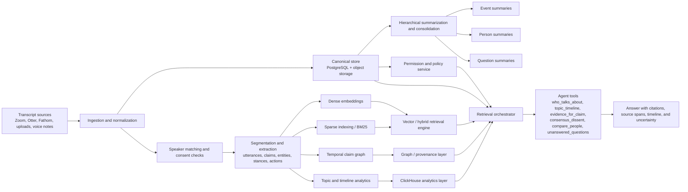
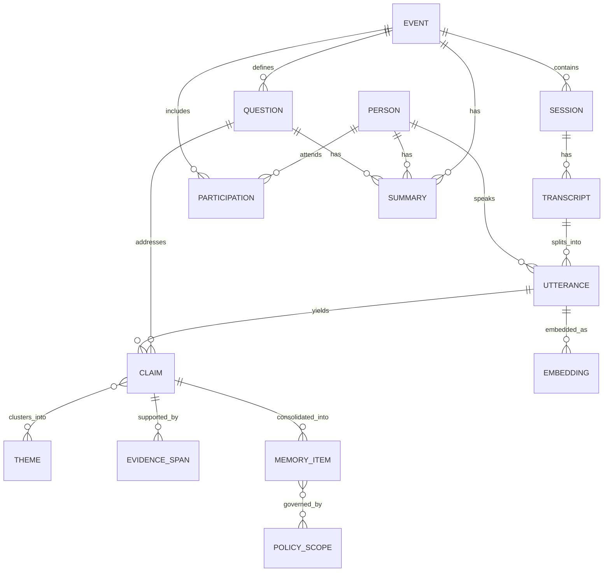
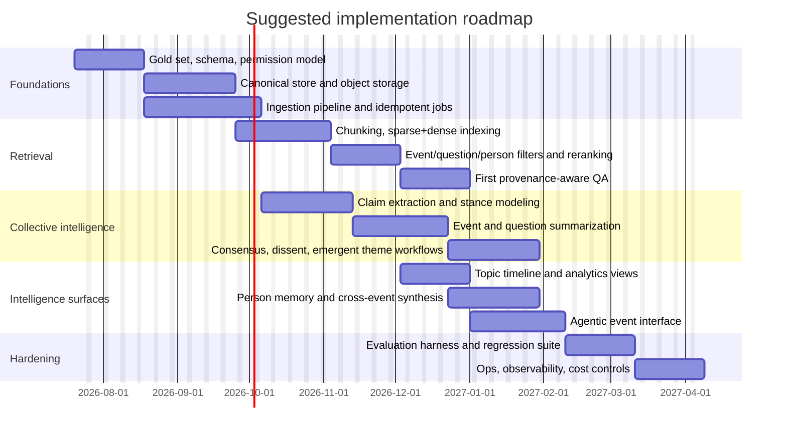

# Memory Systems for Collective-Intelligence Agents Over Event Transcripts

## Executive summary

The center of gravity has shifted. In 2023, many agent systems still treated “memory” as either a longer prompt or a vector store bolted onto chat history. By mid-2026, the strongest architectures separate **working memory**, **episodic memory**, **semantic memory**, and increasingly **governed shared memory**. Long-context models have improved dramatically—OpenAI’s GPT‑4.1 was introduced with 1M-token context, Google’s Gemini 1.5 brought 1M and later 2M-token developer options, and Anthropic moved its platform and paid products into the 500K–1M range for selected models—but longer windows have not removed the need for external memory because they do not solve freshness, provenance, permissioning, temporal correctness, or cost-efficient cross-session retrieval. citeturn3search0turn3search2turn3search10turn3search9turn3search1turn14search4

For your use case—**hundreds of thousands of transcripts organized into events, each event with a defined question set**—the winning pattern is not a single magic “agent database.” It is a **layered memory system**: a canonical transactional store for raw truth and permissions; a hybrid retrieval layer for sparse+dense search; a temporal and/or graph layer for claims, entities, and provenance; a fast analytical store for topic timelines and event-wide aggregation; and a summarization/consolidation layer that produces per-event, per-person, and per-question memory artifacts. The key design move is to make every derived artifact rebuildable from well-versioned source spans. That is how you keep collective intelligence from turning into collective hallucination. citeturn2search11turn20search0turn17search6turn1search6

My practical recommendation is to use **PostgreSQL as the canonical system of record**, plus **object storage** for raw artifacts, plus **one hybrid retrieval engine** and **one optional graph/temporal layer**. A strong default stack is: Postgres + pgvector for canonical memory and metadata; Qdrant, Weaviate, OpenSearch, Pinecone, or Milvus/Zilliz for high-performance hybrid retrieval; ClickHouse for topic/time analytics; and Neo4j or Zep/Graphiti if you want first-class claim lineage, temporal facts, and relationship-centric reasoning. SurrealDB is now substantially more credible than it was in earlier cycles—especially after 2025–2026 work on DiskANN, hybrid/vector features, and GraphQL reach across models—but I still would not make it your only canonical layer until you have validated its operational maturity, observability, and failure behavior under your specific transcript workload. citeturn5search0turn5search5turn10search2turn9search5turn5search11turn20search3turn21search6turn12search12turn12search16

If you want a sentence-length answer: **store truth relationally, retrieve hybridly, reason temporally, summarize hierarchically, and never let an agent cite anything it cannot point back to as an evidence span.** That is the difference between an impressive demo and an institutional memory system you can trust. citeturn17search6turn17search3turn20search1

## Gaps since the prior SurrealDB report

I could not access the specifically named **SURREALDB-ALTERNATIVES-RESEARCH.md** in the provided context. The closest internal documents I could inspect argued for a pragmatic path: **PostgreSQL as source of truth**, embeddings as **derived data**, permission filtering **before retrieval**, background jobs for transcription/summarization/embedding, and any graph or SurrealDB layer kept **derived and rebuildable** until it proves operational value. Those internal docs also explicitly warned against flattening disagreement into false consensus and against permission leakage during retrieval. fileciteturn3file0 fileciteturn3file1

Against that baseline, the big gaps since such a report would likely be these:

First, **SurrealDB itself has moved**. Through 2025–2026 it added or hardened hybrid text+vector patterns, background/deferred index operations, GraphQL reach across full-text/vector/time-series features, and then highlighted **DiskANN** and enterprise observability features in the 3.1 line. That means the old dismissal of SurrealDB as merely interesting-but-early is now too crude; it is a more serious option than it was. But the more important strategic question is no longer “Can SurrealDB do multi-model memory?” It clearly can. The real question is whether you want **one engine to be both system of record and memory runtime**, or whether you prefer a canonical relational core with specialized derived indexes. citeturn12search13turn12search2turn12search9turn12search12turn12search18

Second, the market now has **agent-memory-native layers**, not just vector databases. Zep/Graphiti offers a temporal knowledge graph memory layer; Mem0 positions itself as a persistent memory layer above infra; Anthropic offers a memory tool pattern for cross-conversation persistence; LangChain introduced LangMem; Letta has pushed mem-native work toward context repositories and memory models. In other words, the design space has shifted upward from “which DB should hold embeddings?” to “which layer manages memory promotion, consolidation, versioning, and governed sharing?” citeturn20search0turn20search3turn24search2turn24search6turn14search1turn14search2turn14search18turn14search6

Third, the academic side is far richer than a typical 2024 database comparison would have captured. Since then, the field has produced dedicated memory surveys, stronger benchmarks for long-term conversational and collaborative memory, papers on governed shared memory, multi-user dynamic access control, transactive multi-agent memory, temporal KG memory, and explicit provenance/evidence-tracing frameworks. A database-only comparison now misses the actual hard part: **memory governance and evaluation**. citeturn1search6turn1search7turn16search0turn16search2turn19search0turn18search2turn17search6

Fourth, long-context models have advanced enough that any old report treating vector retrieval as the only route to scale is outdated. But the opposite mistake—assuming 500K–1M tokens eliminate memory architecture—is equally wrong. Long context is excellent for **synthesis passes, adjudication, and local global-summary reads**; it is a poor stand-in for **incremental updates, policy-filtered retrieval, temporal audits, and explainable provenance**. That distinction matters enormously for event intelligence. citeturn3search0turn3search1turn3search2turn14search4turn17search6

## Research landscape through 2026

The modern memory story starts with two influential patterns. **Generative Agents** made “observation → reflection → planning” concrete, showing that storing lived experiences, synthesizing reflections, and retrieving a compact relevant subset can generate believable emergent social behavior. **MemGPT** then reframed memory as an operating-systems problem: page information between fast working context and slower external memory tiers rather than pretending everything fits in prompt space. Those two ideas—**reflection** and **hierarchical memory paging**—still sit under much of what followed. citeturn2search0turn2search1

On the retrieval side, 2023–2026 produced a steady upgrade path from naive chunk retrieval to more selective and more corpus-aware systems. **Self‑RAG** introduced retrieval on demand plus self-critique rather than fixed retrieval every time. **CRAG** focused on correcting bad retrieval and extending to web search when the corpus is weak. **RAPTOR** showed that recursive chunk clustering and summarization improves retrieval over long documents by allowing multiple abstraction levels. **GraphRAG** addressed a different failure mode: broad “global sensemaking” questions over an entire corpus, where ordinary top‑k chunk retrieval performs poorly because the task is really query-focused summarization over the whole dataset. Anthropic’s **Contextual Retrieval** pushed a highly practical improvement—adding chunk-specific context before embedding/BM25—to reduce failed retrievals, especially when chunks are semantically similar or locally ambiguous. citeturn13search0turn13search1turn2search2turn13search3turn14search0

Chunking itself got more sophisticated. The **Late Chunking** work showed that chunk embeddings improve when the model contextualizes a long sequence first and only chunks afterward, preserving document context that naive independent chunking loses. Follow-on analyses in 2025–2026 largely converged on a practical lesson: advanced chunking helps, but its value is workload-specific, and the extra cost is not always justified for latency-sensitive pipelines. That is builder wisdom, not romance. You do not need chunking ideology; you need retrieval curves on your own corpus. citeturn23search4turn23search18turn23search19

Memory architectures for agents then moved beyond document retrieval. **AriGraph** combined episodic and semantic memory in a dynamic knowledge graph for interactive agents. **A‑Mem** treated memory as an agentic note-linking system inspired by Zettelkasten-style dynamic indexing. **Mem0** argued for a memory-centric stack that stores distilled facts/preferences/relationships rather than replaying full chat history; in its evaluations it reported significant latency and token savings over full-context or naive memory baselines. **Zep** used a temporal knowledge graph to track how facts and relationships evolve over time. **MemoryOS** proposed three levels—short-, mid-, and long-term personal memory—with explicit update and retrieval mechanisms. By 2026, surveys were describing agent memory as a **write–manage–read loop** rather than a single store, and dual-process episodic/semantic designs were becoming explicit. citeturn19search2turn1search15turn15search19turn20search0turn1search17turn1search6turn1search8

The newer and more relevant frontier for your brief is **collective memory**. This is where the literature finally starts resembling real event intelligence rather than personalized chat bots. **Collaborative Memory** introduced private and shared tiers with dynamic access control and immutable provenance attributes. **Governed Shared Memory for Multi-Agent LLM Systems** and **Governed Collaborative Memory as Artificial Selection** pushed the idea that shared memory is a governance problem: what gets promoted to institutional memory, by whom, under what policy, with what revision and traceability pathway. **Multi-Agent Transactive Memory** turned shared trajectories into a reusable population-level resource. These papers matter because your system is not merely “one assistant with a long history”; it is a memory substrate for many questions, many people, many events, and eventually many agents. citeturn19search0turn1search2turn18search10turn18search2

Benchmarking also matured. **LoCoMo** and **LongMemEval** became reference points for long-term conversational memory, covering multi-session recall, temporal reasoning, knowledge updating, and abstention. **MemoryAgentBench** moved evaluation into incremental, multi-turn agent settings. **EverMemBench** specifically targeted long-horizon collaborative memory in multi-party, multi-group conversational settings, which is unusually close to your need. On the RAG/provenance side, **GaRAGe** added human grounding annotations for long-form answers, while newer provenance work emphasized that retrieval quality alone is not enough—you must separately evaluate whether claims are correctly attributed and whether unsupported claims are refused. citeturn15search0turn16search0turn16search1turn16search2turn17search3turn17search6

The deepest pattern across all of this is simple: robust memory systems now look less like one giant index and more like a **compacting state machine**. Raw episodes enter. Some are retained as evidence. Some are distilled into semantic memory. Some are promoted to shared institutional memory. Some are superseded, invalidated, or archived. And the best systems keep those transitions inspectable. That is exactly the pattern you need for event-question intelligence, where every output should be answerable by a slightly annoying but entirely justified question: **“show me where that came from.”** citeturn1search6turn20search1turn17search6

### Seminal and high-signal papers to ground the design

| Work | Year | Core contribution | Why it matters here | Sources |
|---|---:|---|---|---|
| Generative Agents | 2023 | Observation, reflection, planning loop over stored experiences | Strong template for event/person memory and emergent social behavior | citeturn2search0 |
| MemGPT | 2023 | OS-style virtual context and hierarchical memory tiers | Still the cleanest mental model for working vs archival memory | citeturn2search1 |
| Self-RAG | 2023 | Retrieval on demand with self-reflection | Good for agentic query interfaces that should retrieve only when needed | citeturn13search0 |
| RAPTOR | 2024 | Tree-organized recursive summarization and retrieval | Useful for corpus-scale question answering and event-level synthesis | citeturn2search2 |
| GraphRAG | 2024 | Graph + community summaries for global questions | Important for “what are the main themes across an event?” | citeturn13search3turn2search11 |
| AriGraph | 2024 | Semantic + episodic memory graph | Useful template for claims, entities, and evolving event context | citeturn19search2 |
| Late Chunking | 2024 | Contextualized chunk embeddings | Relevant for long transcripts and question-aware chunk retrieval | citeturn23search4 |
| Zep | 2025 | Temporal knowledge graph memory layer | Strong fit for provenance, temporal correctness, and changing facts | citeturn20search0 |
| Mem0 | 2025 | Practical persistent memory layer with efficiency claims | Shows production value of distilled long-term memory over replay | citeturn15search19turn24search2 |
| MemoryOS | 2025 | Explicit short/mid/long memory management | Good conceptual fit for consolidation workflows | citeturn1search17 |
| Collaborative Memory | 2025 | Shared/private memory with dynamic access control | Directly relevant to event/public/private boundary design | citeturn19search0 |
| EverMemBench | 2026 | Long-horizon collaborative memory benchmark | Closest public benchmark to multi-party event transcripts | citeturn16search2 |
| MATM | 2026 | Multi-agent transactive memory | Strong lens for collective intelligence across agent teams | citeturn18search2 |
| Evidence tracing and execution provenance | 2026 | Framework for linking claims, evidence, actions, outputs | Essential for provenance-first agent answers | citeturn17search6 |

## Storage and tooling choices

The boring but correct answer is that **storage is a portfolio problem**. Your workload mixes OLTP truth, search, timeline analytics, graph reasoning, permissioning, and batch summarization. If you force one engine to do all of that, you will usually pay for it in one of three currencies: latency, operational fragility, or epistemic mess. A modular core is not architectural cowardice; it is adult supervision. citeturn5search0turn6search1turn21search6turn12search16

### Comparison of production-ready storage and indexing options

| Solution | Category | Scale fit for 100k+ transcripts | Latency profile | Metadata / temporal / provenance | Incremental updates | Multimodal / hybrid retrieval | Cost / ops profile | Best role in this system | Sources |
|---|---|---|---|---|---|---|---|---|---|
| PostgreSQL + pgvector | Relational + vector | Excellent for canonical store and low-to-mid millions of chunks; strong when paired with partitioning and relational schema | Interactive, but filter design and indexing matter a lot | Excellent metadata and temporal querying via SQL, `jsonb`, FTS; provenance is first-class because relations are native | Strong upsert/update story via normal SQL workflows | Hybrid is possible via pgvector + FTS/BM25 patterns; multimodal depends on external embeddings | Lowest incremental cost if you already run Postgres; ops are familiar | **Canonical source of truth** | citeturn5search0turn5search5turn5search17 |
| Qdrant | Vector / hybrid | Strong for millions to billions; multitenancy, payload filtering, WAL-backed updates | Low-latency ANN with real-time indexing; good for filtered search | Rich payload filters; temporal logic mostly via payload fields and scoring formulas, not deep temporal joins | Upserts and payload updates are first-class and durable | Dense + sparse + multivector + multimodal patterns are well supported | Low-to-medium; self-host or cloud | **Hybrid retrieval engine** | citeturn10search2turn10search1turn4search2turn10search8turn10search16 |
| Weaviate | Vector / hybrid | Strong at large object counts; HNSW and dynamic indexing explicitly target scale/latency tradeoffs | Low-latency ANN; docs emphasize hybrid and dynamic index choices to shorten query latency | Good filters; temporal filtering via properties; provenance usually modeled in app layer | Incremental updates supported; HNSW chosen partly because it supports them | Hybrid BM25F + vector, named vectors, near-media search | Medium; managed cloud or self-host | **Hybrid retrieval with developer-friendly APIs** | citeturn8search0turn9search0turn9search1turn4search21turn7search5 |
| Pinecone | Managed vector / hybrid | Explicitly positioned for billion-scale indexes and multitenancy with namespaces | Vendor claims milliseconds at billion-vector scale; filtering runs inside query path | Strong metadata filtering and namespace isolation; temporal logic remains metadata-driven | Real-time indexing and updates are core design points | Dense+sparse hybrid, multimodal search, managed knowledge layer | Medium-to-high managed spend; very low ops burden | **Managed low-latency retrieval** | citeturn8search19turn11search9turn11search3turn11search1turn4search0turn7search0 |
| Milvus / Zilliz Cloud | Distributed vector / hybrid | Strong distributed vector search; designed for large-scale production workloads | Zilliz markets sub‑10ms hybrid search; good choice when vector scale is the main problem | Good metadata filtering and multiple vector fields; temporal/provenance still mostly application-level | Upsert is supported explicitly | Hybrid dense+sparse/full-text and multimodal scenarios are supported | Medium; self-hosted Milvus or managed Zilliz | **High-scale vector retrieval** | citeturn9search2turn9search11turn9search3turn4search15turn7search2 |
| OpenSearch | Search + vector | Very good when keyword search, filters, and existing search-stack operations matter | Interactive hybrid search; good if you already live in search land | Strong document metadata, filtering, aggregations; temporal analysis decent; provenance easier than pure vector DBs because source docs remain native | Continuous ingest is standard search-stack territory | Semantic, hybrid, neural sparse, and multimodal search are all documented | Medium; can be efficient if already deployed | **Sparse-first / enterprise search backbone** | citeturn5search7turn5search11turn5search3turn5search15turn5search19 |
| ClickHouse | Event / analytics + emerging vector | Excellent for huge event streams, timelines, and analytic aggregations; vector support improving rapidly | Best for analytical interactivity; not my first choice as sole retrieval layer | Excellent time-series/event analytics; provenance possible but more warehouse-like than graph-like | High-ingest MergeTree family is a strength | Vector search exists, including ANN indexes in newer versions; hybrid patterns possible but less turnkey for agent retrieval | Medium; very strong price/performance for analytics | **Topic timelines, event analytics, trend detection** | citeturn6search1turn6search14turn6search12turn6search23 |
| Neo4j AuraDB | Graph + vector | Good for entity/claim/relationship graphs, not ideal as the only chunk store | Good enough for graph-filtered retrieval; raw ANN is not its main superpower | Excellent provenance and relationship reasoning; strong temporal modeling in Cypher; vector metadata filtering improved in 2026 | Native graph updates are straightforward | GraphRAG patterns and vector indexes exist; multimodal is app-layer dependent | Medium-to-high managed graph cost | **Claim graph, person/topic graph, provenance explorer** | citeturn21search6turn21search3turn21search21turn21search4 |
| SurrealDB | Multi-model | Promising all-in-one fit for this exact kind of mixed workload | Improving; DiskANN and unified query planning strengthen the case | Strong conceptual story for unified docs/graph/vector/time-series in one engine | CRUD and unified models are native; derived patterns are still a design choice | Vector, hybrid, and graph are all first-class on paper | Potentially attractive infra simplicity, but with more platform risk than Postgres + specialists | **Candidate for consolidation later, not my first MVP canonical layer** | citeturn12search13turn12search12turn12search16turn12search18 |

### Open-source and commercial tooling layers worth watching

| Tool | Type | Why it is relevant | Sources |
|---|---|---|---|
| Zep / Graphiti | Commercial + open-source temporal graph memory | Temporal facts, invalidation of stale facts, hybrid retrieval, real-time graph updates | citeturn20search3turn20search8turn20search2 |
| Mem0 | Commercial + OSS memory layer | Separate memory layer above infra; API for create/search/update memories | citeturn24search2turn24search10turn24search13 |
| Letta | Agent harness / persistent memory | Outgrowth of MemGPT; increasingly explicit about memory-native agent learning | citeturn14search3turn14search18turn14search6 |
| LangMem / LangGraph | OSS agent memory and orchestration | Practical memory patterns for short- and long-term state in agent workflows | citeturn14search2turn14search17 |
| LlamaIndex | Framework for indexing, GraphRAG, agents | Strong for ingestion, indexing pipelines, GraphRAG implementations, and agent tool patterns | citeturn24search1turn24search3turn24search17 |
| Anthropic memory tool + MCP | Official tool / protocol | Cross-session file-based memory pattern and standard interface to tools/data | citeturn14search1turn14search11 |
| OpenAI File Search / Responses tools | Official retrieval/tooling | Useful if you want model-native file retrieval in smaller scoped surfaces | citeturn3search3turn3search11 |

My recommendation for the first serious build is **not** to buy a memory layer first. Build the substrate first. Then add a memory layer only if it clearly reduces your engineering burden without obscuring provenance or governance. Vendors are good at demos. Your transcripts will be better at finding the lies. citeturn20search0turn24search2turn17search6

## Recommended architecture

The architecture below is tuned for five required capabilities: per-event synthesis, per-person synthesis, per-question synthesis, collective-intelligence workflows, and an agentic query interface that can answer **who is talking about what**, **when themes evolved**, and **what evidence supports a claim**. The main design choice is to treat **utterances and claims as evidence units**, while summaries are derived memory products with explicit version lineage. That keeps the system explainable even when the summaries become quite abstract. citeturn17search6turn20search1

A practical default is to separate memory into four layers:

**Working memory** is the event-scoped prompt assembly for the current query. **Episodic memory** stores timestamped utterances, extracted claims, and interaction traces with their event/session/person/question bindings. **Semantic memory** stores distilled facts, recurring themes, person profiles, and question-level abstractions produced by consolidation jobs. **Shared institutional memory** stores only reviewed or policy-eligible summaries and claims that can legitimately travel across events or across agents. This layered split mirrors both the literature and the stronger production systems that have emerged since 2025. citeturn1search6turn1search17turn19search0turn18search10

### Architecture flow

The flow below matches the current best practice: ingest raw truth, normalize and enrich it, index it in multiple ways, then let the agent query through tools rather than by blind prompt stuffing.

This pattern is supported by the research move toward write–manage–read memory loops, GraphRAG-style global synthesis, and provenance-aware agent execution. It also matches the internal recommendation in your adjacent project docs to keep embeddings derived, use idempotent background jobs, and enforce permissions before retrieval. citeturn1search6turn2search11turn17search6 fileciteturn3file0

### Data model

Use an evidence-first schema. The raw utterance is the smallest legally and epistemically durable object. Claims, themes, summaries, and person profiles are derived.

In practice, I would add the following fields because they solve ugly real-world problems early: `source_version`, `consent_scope`, `visibility_scope`, `speaker_confidence`, `claim_confidence`, `temporal_valid_from`, `temporal_valid_to`, `supersedes_claim_id`, `summary_method`, `summary_input_set_hash`, and `evidence_span_offsets`. The last three are what make re-computation and audit sane. Temporal validity and supersession are especially important if different events revise what the group believes. That is not noise; that is memory doing its job. citeturn20search1turn20search8turn17search6

### Indexing, chunking, and embedding strategy

For transcripts, I recommend **three parallel indexes**:

| Layer | Recommendation | Why | Sources |
|---|---|---|---|
| Raw evidence chunks | 250–500 tokens, 50–100 overlap, speaker- and time-aligned | Good balance for quoteable spans and question answering; overlap reduces boundary loss | Inference informed by late chunking/contextual retrieval results. citeturn23search4turn14search0 |
| Section / dialog-turn summaries | 800–1,200 tokens equivalent | Better for event-question synthesis and global theme retrieval | Consistent with RAPTOR/GraphRAG hierarchical abstraction patterns. citeturn2search2turn13search3 |
| Claim / fact memory items | one claim or one canonical fact per item | Makes provenance, contradiction handling, and stance aggregation much cleaner | citeturn17search6turn20search1 |

For embeddings, use **one primary multilingual text embedding model** and **one sparse lexical channel** by default. If your corpus includes slides, screenshots, scanned PDFs, or rich visual documents, add a **multimodal embedding path** for page images or key frames. OpenAI’s `text-embedding-3-large` remains a strong general commercial baseline for multilingual text; Cohere’s Embed 4 and Jina Embeddings v4 are more explicitly multimodal; BGE‑M3 remains a strong open model because it was designed for multi-functionality, multilinguality, and multi-granularity. citeturn22search0turn22search4turn22search1turn22search2turn22search3

I would not rely on dense vectors alone. Use **hybrid sparse+dense retrieval** as the default. In practice the best query flow is: permission prefilter → event/question/person/time prefilter → sparse retrieval → dense retrieval → union → rerank → evidence assembly. Anthropic’s contextual retrieval results and the major vector/search engines’ support for hybrid patterns make this a default recommendation rather than an exotic one. citeturn14search0turn9search1turn11search1turn4search2turn5search11

A useful sizing estimate: if you assume **100,000 transcripts averaging 5,000–12,000 tokens each**, and chunk them at **350 tokens with 80-token overlap**, you end up at roughly **1.9M–4.5M chunks**. At **1,536 dimensions** that is roughly **11–26 GB** of raw float32 vectors; at **3,072 dimensions** it is roughly **22–51 GB**, before metadata, index structures, replicas, and graph/search overhead. In other words, this is large enough to justify real indexing choices, but still comfortably within the operating range of mainstream production systems. The vector-size figures use published embedding dimensions; the chunk-volume range is a design estimate from the assumptions above. citeturn22search8

### Collective-intelligence workflows

To surface **consensus, dissent, and emergent themes**, do not summarize the whole event into one beige smoothie. Run three distinct workflows:

**Consensus workflow.** Normalize claims by question, cluster semantically similar claims, classify stance/polarity, and weight clusters by number of distinct speakers, diversity of speakers, corroborating evidence, and temporal persistence across sessions. Consensus is not “most repeated sentence”; it is **most supported coherent position**, with explicit evidence trails. citeturn13search3turn17search6turn18search14

**Dissent workflow.** Detect contradiction and divergence at the claim level. Store minority positions explicitly, not as bad consensus. Preserve whose view it is, where it appeared, and whether the dissent is substantive, definitional, temporal, or evidential. The internal docs you provided indirectly already anticipated this, and the newer governed/shared-memory literature strongly supports it. fileciteturn3file0 citeturn18search10turn19search0

**Emergent-theme workflow.** Run dynamic clustering over chunks, claims, and question summaries, then track cluster growth over time per event/day/session. GraphRAG-style community summaries are especially good for broad questions like “what is forming across this whole event?” while RAPTOR-style hierarchies help keep local detail reachable. citeturn13search3turn2search2

### Agentic query interface

The event agent should not expose “chat with the database” as its only skill. Give it a tool surface with typed operations such as:

- `who_talks_about(topic, event_id, question_id?, time_range?)`
- `topic_timeline(event_id, topic_or_theme, granularity)`
- `claims_for_question(event_id, question_id, stance?)`
- `evidence_for_claim(claim_id)`
- `compare_people(person_a, person_b, question_id?)`
- `consensus_dissent(event_id, question_id)`
- `unanswered_questions(event_id)`
- `freshness_audit(summary_id)`
- `provenance_trace(answer_id or claim_id)`

This is where MCP-style tool contracts and provider-native tool use help: they let the LLM orchestrate retrieval, not impersonate it. The answer UI should return a prose answer **plus** supporting spans, a mini-timeline, uncertainty flags, and a list of persons/themes mentioned. That is the difference between “helpful” and “governable.” citeturn14search11turn3search11turn17search6

## Evaluation, roadmap, and cost scenarios

The wrong evaluation question is “does the summary look good?” The right questions are: **Was the right evidence found? Were the right claims made? Was disagreement preserved? Did the system abstain when it should? How long did it take? What did it cost?** Recent memory and RAG benchmarks now support exactly that more disciplined framing. citeturn16search0turn16search2turn17search3turn17search6

### Recommended evaluation metrics

| Dimension | Metrics | Benchmark anchors | Notes | Sources |
|---|---|---|---|---|
| Retrieval quality | Recall@k, nDCG@k, MRR, filter precision, permission-leakage rate | LongMemEval, LoCoMo, MemoryAgentBench | Add **time-slice correctness** for temporal queries | citeturn16search0turn15search0turn16search1 |
| Memory quality | Information extraction, multi-session reasoning, temporal reasoning, knowledge updates, abstention | LongMemEval, LongMemEval‑V2 | These map very cleanly to event-question memory | citeturn16search0turn16search9 |
| Collaborative memory | Fine-grained recall, memory awareness, role-conditioned understanding | EverMemBench | Best public anchor for multi-party event settings | citeturn16search2 |
| Synthesis quality | Question coverage, theme diversity, consensus/dissent F1, human pairwise preference | Custom gold set + GraphRAG-style global questions | Use human review for event reports; LLM-as-judge only as a secondary signal | citeturn13search3turn17search15 |
| Factuality / provenance | Attributable claim rate, citation precision/recall, support sufficiency, unsupported-claim rate, abstention precision | GaRAGe, provenance frameworks | Sentence-level provenance beats document-level handwaving | citeturn17search3turn17search6turn17search1 |
| Latency | p50/p95 retrieval, p50/p95 end-to-end answer time, ingestion-to-query freshness SLA | Internal SLOs | Track by query class, not one global average | citeturn20search2turn8search19 |
| Cost | Cost per indexed million chunks, cost per successful grounded answer, token cost per summary refresh | Vendor pricing + internal telemetry | Separate embedding, retrieval, generation, and reindex cost | citeturn7search0turn7search5turn21search4turn7search3 |

You should also maintain a **small hand-labeled gold set** stratified by event type, question type, and answer type. Public benchmarks are useful, but they will not capture your specific subtlety around facilitation language, regenerative themes, or nuanced disagreement. Enterprise RAG evaluation research has become increasingly explicit that generic benchmarks can mislead if you skip domain-specific test sets. citeturn15search6turn17search15

### Implementation roadmap

The roadmap assumes you resist the urge to “platform” too early. Start with one event family, one controlled question taxonomy, one retrieval engine, one evidence UI. Then harden. Distributed elegance can wait; the transcripts will still be there in the morning. fileciteturn3file0

### Low, medium, and high scenarios

These estimates are **illustrative**, exclude salaries, and assume transcripts already exist. They are based on current vendor entry pricing and the typical cost shape of embeddings, retrieval, and summary generation rather than on a single locked vendor stack. citeturn7search0turn7search5turn21search4turn7search3turn20search9

| Scenario | Team shape | Stack shape | Monthly infra / API estimate | What you get |
|---|---|---|---:|---|
| Low | 2–3 engineers, one of them comfortable with data pipelines | Postgres + pgvector, OSS BM25/FTS, optional Qdrant, object storage, minimal analytics | **$500–$3,000/month** | Solid event-question indexing, evidence QA, basic summaries, limited realtime |
| Medium | 4–6 people across backend, data/ML, frontend | Postgres + managed hybrid retrieval + ClickHouse + optional Neo4j/Zep + evaluation harness | **$3,000–$15,000/month** | Strong per-event/person/question synthesis, consensus/dissent workflows, better timelines and provenance UI |
| High | 6–10 people incl. data/ML, platform, product design | Managed retrieval, graph/provenance layer, analytics warehouse, multimodal retrieval, streaming, full evaluation and human-review loops | **$15,000–$75,000+/month** | Near-real-time collective intelligence, multimodal evidence, policy-heavy governance, enterprise reliability |

A good way to choose among these is not by budget first, but by **freshness requirement**. If daily or hourly refresh is enough, a medium architecture is probably ample. If you need near-live event intelligence, topic timelines, and speaker-aware answerability during an event, you need streaming ingestion, incremental indexing, and stronger observability from day one. That moves you upward fast. citeturn10search2turn9search0turn20search3turn6search23

## Conclusion and prioritized next steps

The field’s main lesson through 2026 is that **memory is no longer just retrieval**. It is storage, consolidation, governance, temporal reasoning, and provenance, all under cost and latency constraints. For your specific problem—event-based collective intelligence over very large transcript corpora—the best architecture is a **relational canonical core + hybrid retrieval + temporal/provenance layer + analytical timeline layer + hierarchical summarization pipeline**. Long context helps, but it is an accelerator for synthesis—not a replacement for memory design. citeturn1search6turn13search3turn17search6turn3search0turn3search1

The prioritized next steps are straightforward:

1. **Lock the canonical data model first.** Define event, question, transcript, utterance, claim, theme, summary, permission scope, and provenance entities before you compare databases any further.
2. **Build one evidence-first MVP on PostgreSQL plus one hybrid retrieval engine.** Do not start by betting the company on an all-in-one memory database.
3. **Stand up claim extraction, stance detection, and provenance tracing early.** Consensus and dissent workflows are impossible to trust without them.
4. **Use ClickHouse or an equivalent analytical layer for topic timelines and event-wide trend views.**
5. **Add a graph/temporal layer only where it creates visible value**—for evolving facts, relationship discovery, and source-linked provenance exploration.
6. **Evaluate relentlessly on your own gold set** using retrieval, memory, synthesis, provenance, latency, and cost metrics—not summary aesthetics. citeturn5search0turn10search2turn6search1turn20search1turn17search3turn17search6

If you keep one design principle fixed, make it this: **every abstraction must remain anchored to rebuildable evidence.** Systems that forget that eventually become eloquent fog machines. They look alive right up until someone important asks for receipts.