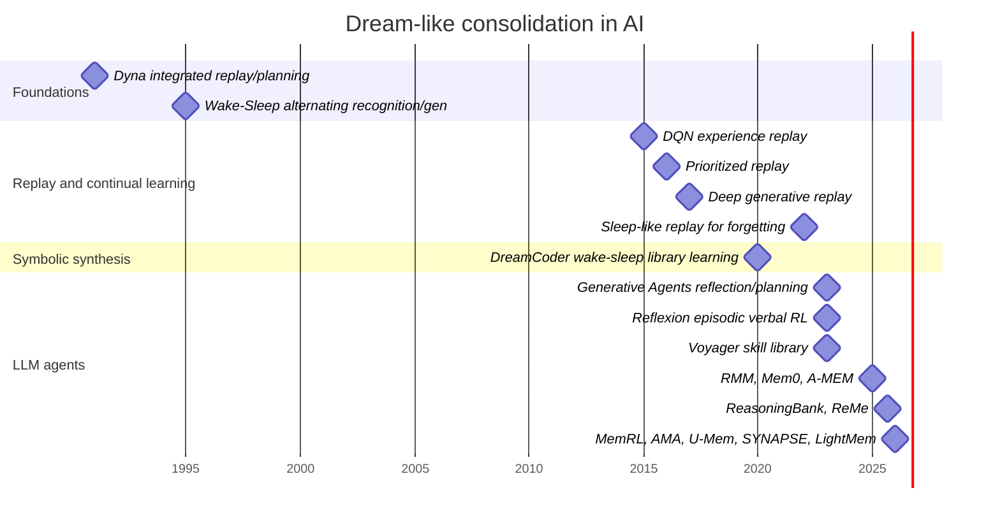
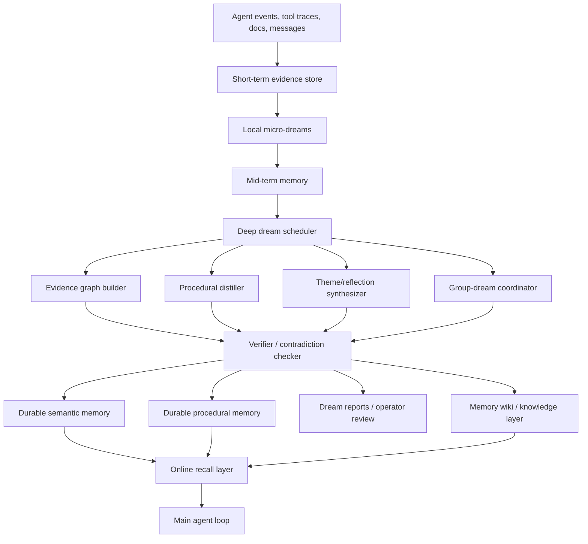

# OpenClaw Dreams and a HERMES Dreaming Architecture

## Executive summary

“OpenClaw dreams” currently refers to two related but importantly different mechanisms. In core OpenClaw, **Dreaming** is an experimental background memory-consolidation subsystem in `memory-core`: it stages short-term evidence, reflects on recurring themes, and promotes only threshold-qualified items into durable memory. In the community plugin **OpenClawDreams**, the idea is more literal: an encrypted sidecar “subconscious” runs daytime reflection plus a nighttime dream narrative, then distills insights back into persistent memory. The first is conservative and reviewable; the second is more generative and speculative. Conflating them is where architecture reviews go to die. citeturn31view0turn3view1turn3view2turn5view0

As of April 26, 2026, the most defensible reading of the state of the art is this: the best memory systems are no longer “just vector stores.” They are **write–manage–read** systems with explicit consolidation, update, and forgetting policies; multiple memory types; offline or periodic synthesis passes; provenance; and increasingly, learned or value-aware retrieval. In fresh 2025–2026 work, the frontier is defined by systems such as Reflective Memory Management, Mem0, A-MEM, ReasoningBank, ReMe, MemRL, U-Mem, SYNAPSE, AMA, LightMem, and Pancake, alongside new benchmarks such as MemBench, AMemGym, Memora, ES-MemEval, PersistBench, and EngramaBench. citeturn13search0turn21search1turn21search3turn30search0turn29search1turn29search6turn28search2turn21search2turn28search3turn21search0turn27search1turn33view1turn33view0turn32view0turn32view1turn33view5turn22search0

For HERMES, the right implementation is **not** a dreamy poetry engine bolted onto a knowledge base. It is a governed, multi-timescale consolidation architecture: fast online recall for the working loop; medium-horizon reflection passes that generate candidate abstractions and procedure updates; and slower deep sweeps that reconcile contradictions, promote durable knowledge, and optionally generate human-readable “dream reports.” If HERMES is multi-agent, then “group dreams” should be treated as a controlled cross-agent consolidation protocol, not as free-form agent gossip. citeturn9view0turn31view0turn21search0turn28search3turn27search2

My recommendation is a **hybrid HERMES design**: use OpenClaw-style evidence gating and provenance as the base layer; add LightMem-style offline consolidation for efficiency; use A-MEM/SYNAPSE-style structured or graph memory for cross-session and cross-agent linkage; add MemRL/ReMe/U-Mem-style utility and refinement loops for procedural improvement; and reserve generative dream narratives for introspection, operator review, and hypothesis generation rather than direct truth promotion. That gives you the upside of dreaming without letting the system mistake metaphor for memory. citeturn31view0turn21search0turn21search3turn21search2turn29search6turn29search1turn28search2

This report prioritizes primary and near-primary sources from arXiv and peer-reviewed venues such as entity["organization","ACL","nlp conference"], entity["organization","WWW","web conference"], entity["organization","NeurIPS","ml conference"], entity["organization","ICLR","ml conference"], entity["organization","ICML","ml conference"], and entity["organization","AAAI","ai conference"], plus official documentation and engineering blogs where they define the live systems and protocols. citeturn32view1turn33view1turn22search14turn12search8turn17search6turn18search2turn16view0turn16view1

## What OpenClaw dreams are

The phrase “OpenClaw dreams” is ambiguous, so it helps to separate **core Dreaming** from **OpenClawDreams**.

In **core OpenClaw Dreaming**, `memory-core` runs a managed sweep with three internal phases: **light** (stage recent short-term material), **REM** (surface themes and reflective signals), and **deep** (promote durable candidates into `MEMORY.md`). The process writes machine state into `memory/.dreams/`, human-readable reports into `DREAMS.md`, and deep promotions into `MEMORY.md`. Promotion is thresholded, not free-form: candidates are ranked by weighted signals including frequency, retrieval relevance, query diversity, recency, consolidation, and conceptual richness, with additional reinforcement from light/REM phase hits. The default sweep cadence is daily at `0 3 * * *`, and manual `memory promote` runs use the same deep-phase defaults unless overridden. citeturn31view0turn3view1turn3view2

That built-in mechanism is fundamentally a **grounded consolidation engine**. It can ingest redacted session transcripts, but sensitive content is supposed to be redacted before ingestion. Its Dream Diary is explicitly for human review and UI visibility, not for promotion; diary artifacts are excluded from short-term promotion. It also supports **grounded historical backfill**, which lets operators replay historical daily notes into the same short-term evidence lane used by the normal deep phase. That is already a serious “dreaming” design: not mystical, but a periodic sweep over an evolving body of work with explicit replay, reflection, and durable promotion. citeturn31view0turn10search1

In contrast, **OpenClawDreams** is a separate plugin that behaves like a hidden sidecar subconscious. It stores encrypted conversation summaries and workspace diffs in its own SQLite database, runs a daytime reflection cycle that extracts topics and optionally enriches them with web and social-agent context, then runs a nighttime dream cycle that decrypts undreamed memory, generates either a dream or 5%-probability nightmare, grounds the surreal output back into a “waking realization,” and pushes only a consolidated insight to OpenClaw’s persistent memory. It tracks previously explored territory to push future dreams toward novelty, and it exposes its own operator notification and posting pipeline. citeturn5view0turn6search0

Operationally, the two systems are at different maturity levels. Core Dreaming is now documented in current OpenClaw docs and is present in recent 2026.4.x releases, with the GitHub releases page showing `2026.4.24` as the latest stable tag on April 26, 2026, plus `2026.4.25-beta.*` prereleases. But it is still marked experimental, and open issues in April 2026 report configuration mismatches, promotion runs with zero candidates because recall counts never accumulate, and orphaned narrative sessions. That does not mean “don’t use it”; it means “use it like a smart engineer, not a romantic.” citeturn8view5turn3view2turn8view0turn8view1turn8view2turn8view3

### Comparison of the two OpenClaw dream architectures

| System | Primary purpose | Memory substrate | Periodic schedule | Promotion rule | Narrative output | Risk profile |
|---|---|---|---|---|---|---|
| Core Dreaming in `memory-core` | Grounded consolidation and durable promotion | `memory/.dreams/` + daily notes + optional redacted transcripts | One managed cron sweep; default daily at 03:00 | Weighted ranking + thresholds (`minScore`, `minRecallCount`, `minUniqueQueries`) | Dream Diary for human review only | Experimental but relatively conservative |
| OpenClawDreams plugin | Hidden reflective sidecar with surreal synthesis | Encrypted SQLite + local markdown dream artifacts | Internal `setInterval`; multiple reflection runs daily, dream at 02:00, optional morning post | Consolidated insight distilled from dream pipeline | Explicit dream / nightmare narratives | Alpha, higher creativity and leakage risk |

The table above is synthesized from the official OpenClaw Dreaming and memory docs plus the OpenClawDreams README and repository metadata. citeturn31view0turn3view1turn3view2turn5view0turn6search0

## Research lineage and the state of the art

### The historical lineage

The deeper idea behind dream systems is older than OpenClaw by decades. **Dyna** framed learning, planning, and reacting as an integrated architecture in which replayed or simulated experience improves future behavior. The **wake-sleep** algorithm introduced alternating phases for recognition and generative refinement. **Deep Q-Networks** made experience replay central to stable deep RL, and **Prioritized Experience Replay** showed that replay quality matters as much as replay quantity. **Deep Generative Replay** replaced stored old samples with generated pseudo-experience. **Sleep-like replay** then reintroduced biologically inspired offline consolidation, showing that spontaneous replay phases can reduce catastrophic forgetting. **DreamCoder** is especially relevant here: it alternates wake-sleep-style problem solving and abstraction learning, extending its internal language and training search policies on imagined and replayed problems. citeturn18search1turn18search0turn17search1turn36view1turn36view0turn35view0turn35view5



The important pattern is stable across eras: **collect experience, sweep it periodically, compress it into a better memory or policy, then re-use it later**. What changes over time is the representation—transitions, latent states, symbolic libraries, natural-language reflections, graphs, or utility-weighted memories. citeturn18search1turn36view1turn35view5turn12search0turn12search1turn12search2

### The LLM-agent lineage

The modern LLM-agent version begins with **Generative Agents**, which store a stream of experiences, retrieve them by relevance/recency/importance, and synthesize reflections that influence future planning. **Reflexion** turns self-critique into episodic verbal memory. **Voyager** uses an ever-growing skill library of executable procedures. **Reflective Memory Management** adds prospective and retrospective reflection with retrieval refinement. **Mem0** and **A-MEM** push memory organization toward production-grade extraction, consolidation, graph structure, and adaptive linking. citeturn12search1turn12search0turn12search2turn13search0turn21search1turn21search3

By 2025–2026, the frontier moves from “store more” to **self-evolving memory**. **ReasoningBank** distills reusable strategies from successful and failed experiences and pairs them with memory-aware test-time scaling. **ReMe** closes the procedural-memory loop with multi-faceted distillation, context-adaptive reuse, and utility-based refinement. **MemRL** learns memory utility with value-aware retrieval and utility-driven curation. **U-Mem** actively acquires and validates knowledge rather than passively waiting for it. **AMA** uses coordinated memory agents to adapt retrieval granularity and repair inconsistencies. **SYNAPSE** and Engrama-style graph systems improve cross-space and multi-hop reasoning by making relations first-class. **LightMem** shows that a small-model sidecar can make consolidation cheap enough for real use. **Pancake** makes the serving layer itself memory-aware for multi-agent workloads. citeturn30search0turn29search1turn29search6turn28search2turn28search3turn21search2turn22search0turn21search0turn27search1

The synthesis of the 2026 literature is blunt: the best memory systems are now **lifecycle-managed systems**, not passive stores. Surveys from early 2026 describe agent memory as a write–manage–read loop and point to open challenges in continual consolidation, causally grounded retrieval, trustworthy reflection, learned forgetting, privacy governance, and multi-agent teamwork. The companion line of work on memory operating systems argues for hierarchical storage, explicit updates, versioning, and access governance. citeturn13search1turn28search6turn13search2turn13search3

### Comparison of the main architectural families

| Family | Representative systems | Representation | Sweep / update style | Main strength | Main weakness | Best use in HERMES |
|---|---|---|---|---|---|---|
| Thresholded grounded consolidation | Core OpenClaw Dreaming | Snippets + evidence scores | Scheduled light/REM/deep sweep | Explainable, safe-ish promotion | Conservative; can miss weak-but-important abstractions | Base durable-memory pipeline |
| Surreal reflective sidecar | OpenClawDreams | Encrypted episodic store + narrative synthesis | Multi-stage daily reflection + nightly dream | Novelty and thematic synthesis | Leakage, instability, weaker truth guarantees | Optional operator-facing introspection |
| Verbal episodic reflection | Reflexion, Generative Agents | Natural-language memories/reflections | Event-driven + thresholded reflection | Easy to implement; good for behavioral correction | Verbose, drifts, limited structure | Fast procedural coaching |
| Skill/procedure memory | Voyager, ReMe, ReasoningBank | Code skills or reasoning strategies | Distill after tasks; re-use at inference | Strong transfer and self-improvement | Harder credit assignment, curation burden | Tool-use and workflow memory |
| Utility-learned memory | MemRL, U-Mem | Episodic memories with learned utility | Runtime RL / active acquisition | Better reuse under feedback | More engineering and evaluation complexity | High-value procedures and reasoning patterns |
| Structured / graph memory | A-MEM, SYNAPSE, Engrama | Linked notes, graphs, activation networks | Continuous linking + periodic repair | Better multi-hop and cross-space reasoning | More storage/schema complexity | Cross-agent and cross-project knowledge |
| Efficient offline consolidation | LightMem, Mem0 | STM/MTM/LTM + extracted salience | Online retrieval; offline consolidation | Low latency and lower cost | Quality depends on extraction/reranking | Default operating mode for production HERMES |
| Multi-agent memory infrastructure | AMA, Pancake, multi-agent memory hierarchy | Hierarchical shared/distributed memory | Coordinated or consistency-aware updates | Better scaling across agents | Consistency and access-control headaches | Group dreams and shared memory serving |

This synthesis is grounded in the cited system papers and benchmark results rather than any single benchmark leaderboard. The short version: HERMES should combine the first, fourth, sixth, seventh, and eighth rows. The second row is dessert, not dinner. citeturn31view0turn5view0turn12search0turn12search1turn12search2turn29search1turn30search0turn29search6turn28search2turn21search3turn21search2turn22search0turn21search0turn21search1turn28search3turn27search1turn27search2

## Group dreams across agents

“Group dreams” are not yet a standardized term in the literature, so this section is an inference from adjacent work. I use the phrase to mean **a periodic cross-agent consolidation pass that fuses partially overlapping agent memories into shared hypotheses, protocols, or durable abstractions**. In other words: multiple agents sleep on the same problem, then wake up speaking in slightly fewer contradictions. citeturn27search2turn24search3turn24search6

The communication layer matters. For tool and data access, the most relevant open standard is **MCP**, introduced by entity["company","Anthropic","ai company"] as an open protocol for secure two-way connections between AI tools and data sources. For agent-to-agent collaboration, the most relevant official standard is **A2A**, launched by entity["company","Google","technology company"] and later documented as a cross-framework open standard, now under the entity["organization","Linux Foundation","open source consortium"] ecosystem, designed so agents can securely exchange information and coordinate actions. OpenClaw’s own **ACP bridge** is narrower and editor/session-oriented, but it is useful if HERMES has coding or IDE-facing agents. The emerging **Mesh Memory Protocol** is interesting because it argues that multi-agent systems also need a semantic memory layer: field-level acceptance, lineage, and role-indexed remix instead of blind message ingestion. citeturn16view1turn16view0turn16view3turn16view2turn28search0

Social and cognitive emergence is already visible in the broader multi-agent literature. **CAMEL** and **AutoGen** show that structured multi-agent roles and conversation patterns support autonomous cooperation. **ReConcile** and related debate frameworks improve consensus through multi-round argument and voting. The 2025 Science Advances paper on emergent social conventions shows that decentralized LLM populations can form shared conventions and collective biases without central coordination, and 2025–2026 work on emergent coordination and decentralized collective memory shows that higher-order coordination and distributed collective memory can arise from local interaction plus persistent traces. That means group dreams in HERMES are plausible—but they will produce both useful norms and weird ones if left unsupervised. citeturn26search1turn26search0turn26search6turn24search9turn24search6turn24search3

### Recommended synchronization strategies

| Strategy | Mechanism | Upside | Failure mode | HERMES recommendation |
|---|---|---|---|---|
| Barrier-synchronized nightly dream | All agents stop, publish candidate memories, run one shared consolidation epoch | Strong consistency and easier auditing | High latency; brittle if one agent stalls | Good for durable weekly/nightly promotion |
| Rolling micro-dreams | Agents consolidate locally every N events or minutes | Cheap and responsive | Divergent schemas; stale cross-agent state | Good for local STM→MTM compression |
| Judge/refresher committee | Specialist agents draft, retrieve, verify, and repair memories | Better disagreement handling | More tokens, more orchestration complexity | Best for shared semantic/procedural memory |
| Gossip / eventual consistency | Agents exchange compact summaries and reconcile later | Scales well; resilient | Echo chambers, duplication, drift | Good only with strong lineage and freshness controls |
| Blackboard / shared workspace trace | Agents leave structured traces in a shared store | Emergent collective memory | Message poisoning; local errors go global | Good for evidence, bad for direct truth promotion |

The synchronization and protocol recommendations above draw on AMA’s judge/refresher design, the multi-agent memory hierarchy literature, A2A/MCP/ACP standards, and emergence work on conventions and collective memory. citeturn28search3turn27search2turn16view0turn16view1turn16view2turn24search9turn24search3

### Expected emergent behaviors

Useful emergent behaviors include **division of mnemonic labor** (different agents become reliable custodians of different memory types), **shared shorthand or norms**, **cross-agent abstraction** (“this is the same failure pattern in three different domains”), and **synergy** in which the group can solve or explain things that no single agent’s raw memory predicts. These are strongly suggested by debate, coordination, and collective-memory results. citeturn26search6turn24search6turn24search3

The dark mirror is also obvious: **collective bias**, **groupthink**, **message-channel attacks**, **memory poisoning**, **cross-domain leakage**, **memory-induced sycophancy**, and **over-action / over-refusal loops** in self-evolving agents. In multi-agent systems, the message bus is an attack surface; in long-term memory systems, the write path is an attack surface; in self-evolving systems, successful benign habits can still degrade safety in high-risk tasks. Group dreams magnify all three if not governed. citeturn24search9turn23search1turn23search2turn33view5turn34search1turn34search2

## HERMES architecture and implementation roadmap

Because HERMES is unspecified, I assume it already has: a multi-agent runtime, an event or transcript log, a memory API, a task scheduler, a search layer, and some operator-visible observability. If any of those are missing, dream architecture should wait until they exist. Sleep without a pulse is not enlightenment; it is just a crashed daemon. The key design principle is to **separate waking recall from offline dreaming**: keep online retrieval bounded and cheap, and move broad synthesis, contradiction repair, and durable promotion into scheduled sweeps. That split is exactly what OpenClaw’s Active Memory plus Dreaming, and LightMem’s online/offline division, get right. citeturn9view0turn31view0turn21search0



The architecture above intentionally separates **evidence**, **abstraction**, **verification**, and **promotion**. That is the main lesson from OpenClaw Dreaming, A-MEM, SYNAPSE, AMA, LightMem, and the memory-operating-system literature: do not let the same component both fantasize and canonize. citeturn31view0turn21search3turn21search2turn28search3turn21search0turn13search2turn13search3

### Recommended memory layers for HERMES

| Layer | Representation | Writer | Reader | Promotion rule |
|---|---|---|---|---|
| Working memory | Current tool state and prompt context | Main agent loop | Main agent loop | Expires automatically |
| Episodic short-term memory | Event records, session summaries, tool traces | Event pipeline | Local micro-dreams and retrievers | Time/usage-based |
| Mid-term memory | Clustered notes, session summaries, unresolved hypotheses | Local dreamers | Main agents + deep sweeps | Frequency + recency + support |
| Durable semantic memory | Facts, entities, relations, constraints | Deep sweeps + verifiers | All agents | Multi-source support + contradiction checks |
| Durable procedural memory | Tactics, workflows, refusal patterns, repair heuristics | Procedural distiller | Planner/executor agents | Utility over repeated reuse |
| Group memory | Shared abstractions, cross-agent agreements, conventions | Group-dream coordinator | Team agents | Consensus or judged merge |
| Dream reports | Human-readable diary / explanation artifacts | Reflection synthesizer | Operators only | Never direct truth source |

This layered design is the natural generalization of OpenClaw’s Dreaming, OpenClaw memory-wiki’s compiled knowledge layer, graph/agentic memory systems, and recent procedural-memory work. citeturn31view0turn3view4turn21search3turn21search2turn29search1turn30search0

### Recommended sweep schedule for a first HERMES deployment

A strong starting point is a **three-timescale schedule**:

- **Micro-dream** every 30–60 minutes or every 50–200 events: dedupe, cluster, summarize, and extract candidate procedures.
- **Deep local dream** nightly: verify, merge, promote, and forget stale or contradicted items.
- **Group dream** weekly, or nightly for tightly coupled agent teams: reconcile cross-agent abstractions and agreements.

That recommendation blends OpenClaw’s daily deep sweep, OpenClawDreams’ more frequent reflection cycle, and LightMem’s explicit separation of online retrieval from offline consolidation. citeturn31view0turn5view0turn21search0

### Pseudocode for a HERMES dream cycle

The pseudocode below combines OpenClaw-style evidence gating, graph/provenance memory, and multi-agent repair loops inspired by AMA, ReMe, MemRL, and ReasoningBank. citeturn31view0turn28search3turn29search1turn29search6turn30search0

```python
def run_hermes_dream_cycle(scope: str, agent_ids: list[str], now):
    # scope: "local" or "group"

    evidence = ingest_new_events(agent_ids, since=last_checkpoint(scope))
    stm_notes = cluster_and_dedupe(evidence)

    # Light / micro-dream
    candidates = []
    for note in stm_notes:
        c = build_candidate(
            content=note.content,
            provenance=note.provenance,
            recency_score=decay(note.timestamp, half_life_days=14),
            frequency=count_recurrence(note),
            query_diversity=count_distinct_contexts(note),
            support_sources=count_independent_sources(note),
        )
        candidates.append(c)

    # REM / reflective synthesis
    themes = synthesize_themes(stm_notes)
    procedures = distill_procedures(stm_notes, failures=True, successes=True)

    # Group-dream lane
    if scope == "group":
        cross_agent_graph = link_cross_agent_candidates(candidates, themes, procedures)
        debated = committee_review(
            constructor_agent="builder",
            retriever_agent="retriever",
            judge_agent="verifier",
            refresher_agent="repairer",
            graph=cross_agent_graph,
        )
        candidates = merge(candidates, debated.promotable_items)

    # Deep promotion
    promotable = []
    for c in candidates:
        if (
            c.total_score >= 0.80 and
            c.frequency >= 3 and
            c.query_diversity >= 3 and
            verify_live_source(c) and
            contradiction_check(c) == "pass"
        ):
            promotable.append(c)

    # Durable writes
    write_semantic_memory(promotable)
    write_procedural_memory(rank_by_utility(procedures))
    write_dream_report(themes, promotable, procedures, scope=scope)

    # Governance and forgetting
    prune_stale_or_invalidated_items()
    update_lineage_and_indexes()
    refresh_online_recall_cache()

    return {
        "promoted": len(promotable),
        "themes": len(themes),
        "procedures": len(procedures),
        "contradictions_fixed": count_repairs(),
    }
```

### Implementation phases

The least-regret roadmap is sequential.

**Phase one** should implement grounded local dreaming only: event ingestion, candidate clustering, evidence scoring, contradiction checks, and durable semantic/procedural memory writes. Do not ship group dreams yet. Use operator-visible reports and promotion explanations from day one. OpenClaw’s `memory promote-explain` and Dream Diary split are good design instincts here. citeturn31view0turn3view1

**Phase two** should add graph structure and compiled knowledge. This is where A-MEM, SYNAPSE, and memory-wiki-style compilation become useful: you want durable knowledge to look less like a heap of snippets and more like a provenance-rich graph or maintained wiki. That is what improves cross-space retrieval, interpretability, and later group reconciliation. citeturn21search3turn21search2turn3view4turn22search0

**Phase three** should add utility-driven procedural memory. ReMe, ReasoningBank, MemRL, and U-Mem all point in the same direction: durable “how to” knowledge should not be a transcript graveyard; it should be distilled, judged, and pruned by reuse value. For HERMES, this is the moment to formalize tactics, safety refusals, tool-use heuristics, and repair playbooks as first-class procedural memory. citeturn29search1turn30search0turn29search6turn28search2

**Phase four** should add group dreams with strict governance: limited schemas, lineage, acceptance policies, and scoped access control. Start with one tightly coupled team of agents before any global shared dream layer. Multi-agent memory consistency is still an open research problem, not a solved engineering checkbox. citeturn27search2turn28search0turn16view0

## Evaluation, safety, and resource model

### What to measure

The evaluation suite for HERMES dreaming should mix **task quality**, **memory quality**, **consistency**, **safety**, and **efficiency**.

| Category | What to measure | Suggested benchmarks / tests |
|---|---|---|
| Recall and reasoning | F1 / EM / judge scores on long-horizon tasks | LoCoMo, MemBench, ES-MemEval, EngramaBench |
| Mutation handling | Accuracy after updates, deletions, preference reversals | Memora, RealPref |
| Personalization and dialogue quality | Summarization and generation quality under evolving user state | ES-MemEval, AMemGym |
| Safety | Cross-domain leakage, sycophancy, poisoning success, abstention quality | PersistBench + custom poisoning tests |
| Multi-agent performance | Agreement, complementary contribution, synergy, contradiction rate | Group-task harness + emergence metrics |
| Efficiency | p50/p95 latency, token cost/day, retrieval ms, storage growth | Internal load tests; compare against full-context baselines |

Those metrics are grounded in the recent benchmark ecosystem rather than invented in-house, which is exactly what you want if you are trying to avoid self-flattering dashboards. citeturn14search0turn33view1turn32view1turn22search0turn32view0turn22search5turn33view0turn33view5

A practical benchmark portfolio for HERMES would use **LoCoMo** for long-range conversational recall and reasoning, **MemBench** for factual versus reflective memory under different interaction scenarios, **AMemGym** for on-policy long-horizon evaluation, **Memora** for update-aware memory mutation and FAMA, **ES-MemEval** for temporal reasoning, conflict detection, abstention, and user modeling, and **PersistBench** for memory-specific safety failures. If HERMES needs structured cross-space graph retrieval, add **EngramaBench**. citeturn14search0turn33view1turn33view0turn32view0turn32view1turn33view5turn22search0

### Safety and alignment implications

The main safety lesson is simple: **dreaming expands the write path**, and the write path is where long-term systems become permanently wrong. PersistBench shows frequent failures around cross-domain leakage and memory-induced sycophancy; memory-poisoning work shows that query-only interactions can corrupt long-term memory; and the April 2026 security survey frames risks across the full lifecycle: write, store, retrieve, execute, share, and forget/rollback. In self-evolving agents, recent work also shows a direct safety–utility trade-off: experience that improves action on benign tasks can still make systems too action-oriented in risky settings. citeturn33view5turn23search2turn34search2turn34search1

For multi-agent group dreams, the corresponding problem is **message trust**. Agent-in-the-Middle attacks show that manipulating inter-agent messages can compromise an entire multi-agent system even without compromising individual agents. That means HERMES group dreams need signed provenance, role-scoped visibility, field-level merge policies, and explicit “do not consolidate” labels for untrusted or low-confidence content. If you skip that, your agents will eventually develop a shared memory of something that never happened—very social, very efficient, and entirely wrong. citeturn23search1turn28search0turn27search2

There are also privacy and governance issues in the OpenClaw examples themselves. Core Dreaming redacts personal and sensitive transcript content before ingestion, which is the correct direction. OpenClawDreams, meanwhile, warns that public posting of dream reflections can leak recognizable fragments of private conversations and relies on filtering and operator approval as best-effort mitigations. HERMES should therefore implement **write-time redaction**, **sensitivity tagging**, **rollback**, **scoped retrieval**, and **human review for outward-facing dream reports**. citeturn31view0turn5view0

### Resource requirements

Core OpenClaw Dreaming is comparatively cheap: most of its deep ranking is heuristic/statistical, while diary generation uses best-effort background subagent turns. OpenClawDreams is more expensive, with roughly 10–15 LLM calls per day under its default schedule and a default daily token budget kill switch of 800k tokens. Newer systems such as LightMem and Mem0 show that large quality gains do not require putting a frontier model on every memory operation: LightMem reports low-latency memory operations with a small-model memory sidecar, and Mem0 reports major latency and token reductions versus full-context approaches. At the multi-agent serving layer, Pancake shows that memory-serving architecture can become the dominant systems bottleneck and that coordinated hierarchical memory management materially improves throughput. citeturn31view0turn5view0turn21search0turn21search1turn27search1

For HERMES, the most sensible resource posture is therefore:

- use a **small model or non-LLM heuristics** for online memory extraction, candidate clustering, and first-pass reranking;
- reserve a **larger model** for nightly deep synthesis, contradiction repair, and operator-facing dream reports;
- store **compressed notes plus provenance**, not raw transcripts by default;
- treat **group dreams** as expensive batch jobs, not continuous background chatter.

That recommendation is not just frugality; it follows the current best evidence on latency, token cost, and serving bottlenecks. citeturn21search0turn21search1turn27search1turn13search1

## Recommended experiments and open questions

### Recommended experiments

| Experiment | Compare | Hypothesis | Success criterion |
|---|---|---|---|
| Grounded vs narrative dreams | OpenClaw-style promotion vs dream-report synthesis | Grounded promotion improves factual reliability; narrative reports improve novelty and operator usefulness | Higher factual precision with unchanged or improved user-rated insightfulness |
| Sweep-frequency ablation | Hourly / 6-hour / nightly / weekly | More frequent sweeps improve freshness up to a point, then amplify drift and cost | Best F1/FAMA to cost ratio |
| Memory representation ablation | Flat vector vs linked notes vs graph + activation | Graph memory helps cross-space and temporal reasoning | Better EngramaBench- and LoCoMo-style cross-space performance |
| Procedural-memory ablation | No procedure memory vs ReMe/ReasoningBank/MemRL-style layer | Distilled procedures reduce repeated failures and lower cost | Fewer repeated error classes, higher task success per token |
| Group-dream topology | Barrier, committee, gossip, blackboard | Committee/judge-refresher topology gives best precision for shared memory | Highest agreement with lowest contradiction and poisoning rate |
| Safety-governance ablation | No write filter vs verified write path + rollback + scoped access | Most memory failures come from writes, not reads alone | Lower PersistBench-like failures and poisoning success with acceptable utility |

These experiments map cleanly onto the current benchmark and architecture literature, especially AMemGym, Memora, PersistBench, ReMe, MemRL, AMA, LightMem, and the multi-agent emergence papers. citeturn33view0turn32view0turn33view5turn29search1turn29search6turn28search3turn21search0turn24search6

### Open questions and limitations

Several uncertainties remain. First, HERMES internals are unspecified, so the integration plan assumes capabilities that may not exist yet. Second, some of the strongest 2026 results are still fresh preprints rather than mature, independently replicated systems. Third, “group dreams” is a useful architectural concept, but it is still a synthesis of adjacent memory, multi-agent, and emergence work rather than a settled subfield with standard protocols or benchmarks. Finally, OpenClaw Dreaming itself is clearly evolving in public, with active April 2026 bug reports around config surfaces and promotion reliability; it is already useful, but it is not yet boring infrastructure. citeturn13search1turn27search2turn8view0turn8view1turn8view2turn8view3

The cleanest recommendation for HERMES is therefore this: implement dreams as **governed periodic synthesis over evidence**, not as unconstrained creative generation; separate **local** and **group** dreaming; promote only grounded memories; keep narratives explanatory rather than canonical; and make memory updates observable, reversible, and benchmarked against long-horizon mutation and safety tests. That is the architecture most consistent with the strongest historical ideas—replay, wake-sleep, abstraction learning, reflection, and continual consolidation—and with the best 2025–2026 systems evidence. citeturn18search1turn35view5turn12search1turn12search0turn30search0turn21search0turn28search3turn33view5